This project is a work-in-progress attempt to create a practical set of sprite sheets for [OpenMoji.org](https://openmoji.org/) emojis. The sprite sheets presented here were generated with [axelpale/openmoji-spritemap-generator](https://github.com/axelpale/openmoji-spritemap-generator) and are licensed under [CC-BY-SA 4.0](https://creativecommons.org/licenses/by-sa/4.0/legalcode).

* [😀 smileys-emotion 72x72](#-smileys-emotion-72x72)
* [👋 people-body 72x72)](#-people-body-72x72)
* [🐵 animals-nature 72x72](#-animals-nature-72x72)
* [🍇 food-drink 72x72](#-food-drink-72x72)
* [🌍 travel-places 72x72](#-travel-places-72x72)
* [🎃 activities 72x72](#-activities-72x72)
* [👓 objects 72x72](#-objects-72x72)
* [🏧 symbols 72x72](#-symbols-72x72)
* [🦄 extras-openmoji 72x72](#-extras-openmoji-72x72)
* [ℹ about](#ℹ-about)

## 😀 smileys-emotion

[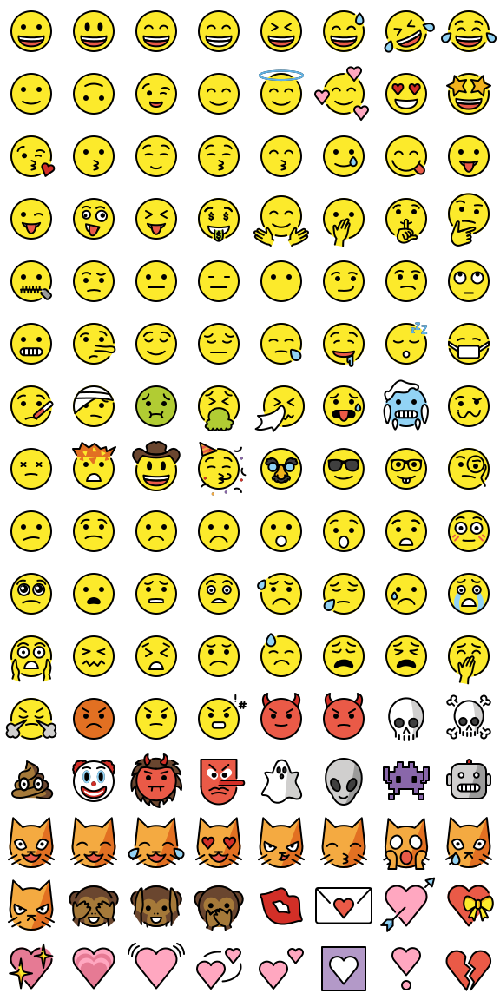](png/smileys-emotion.png)

  
<strong>PNG 72px sheets</strong>

  Merged image: [png/smileys-emotion.png](png/smileys-emotion.png) 
  HTML image map: [png/smileys-emotion.html](png/smileys-emotion.html) 
  CSS sprite sheet: [png/smileys-emotion.css](png/smileys-emotion.css) 
  CSS sprite example: [png/smileys-emotion-css.html](png/smileys-emotion-css.html) 
  Custom JSON: [png/smileys-emotion.json](png/smileys-emotion.json)

  
<strong>SVG sheets</strong>

  Merged image: [svg/smileys-emotion.svg](svg/smileys-emotion.svg) 
  HTML image map: [svg/smileys-emotion.html](svg/smileys-emotion.html) 
  CSS sprite sheet: [svg/smileys-emotion.css](svg/smileys-emotion.css) 
  CSS sprite example: [svg/smileys-emotion-css.html](svg/smileys-emotion-css.html) 
  Custom JSON: [svg/smileys-emotion.json](svg/smileys-emotion.json)

 

[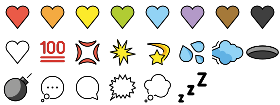](png/smileys-emotion-1.png)

  
<strong>PNG 72px sheets</strong>

  Merged image: [png/smileys-emotion-1.png](png/smileys-emotion-1.png) 
  HTML image map: [png/smileys-emotion-1.html](png/smileys-emotion-1.html) 
  CSS sprite sheet: [png/smileys-emotion-1.css](png/smileys-emotion-1.css) 
  CSS sprite example: [png/smileys-emotion-1-css.html](png/smileys-emotion-1-css.html) 
  Custom JSON: [png/smileys-emotion-1.json](png/smileys-emotion-1.json)

  
<strong>SVG sheets</strong>

  Merged image: [svg/smileys-emotion-1.svg](svg/smileys-emotion-1.svg) 
  HTML image map: [svg/smileys-emotion-1.html](svg/smileys-emotion-1.html) 
  CSS sprite sheet: [svg/smileys-emotion-1.css](svg/smileys-emotion-1.css) 
  CSS sprite example: [svg/smileys-emotion-1-css.html](svg/smileys-emotion-1-css.html) 
  Custom JSON: [svg/smileys-emotion-1.json](svg/smileys-emotion-1.json)

## 👋 people-body 72x72

[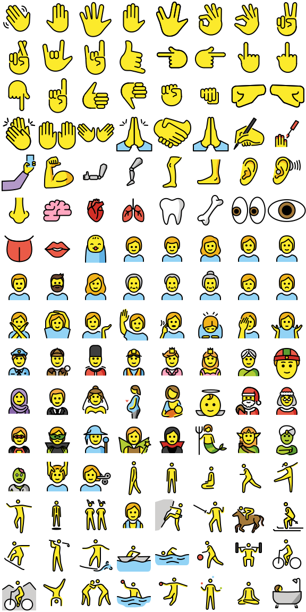](png/people-body.png)

Merged image: [png/people-body.png](png/people-body.png) 
HTML image map: [png/people-body.html](png/people-body.html) 
CSS sprite sheet: [png/people-body.css](png/people-body.css) 
CSS sprite example: [png/people-body-css.html](png/people-body-css.html) 
Custom JSON: [png/people-body.json](png/people-body.json)

[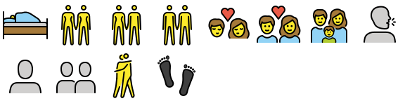](png/people-body-1.png)

Merged image: [png/people-body-1.png](png/people-body-1.png) 
HTML image map: [png/people-body-1.html](png/people-body-1.html) 
CSS sprite sheet: [png/people-body-1.css](png/people-body-1.css) 
CSS sprite example: [png/people-body-1-css.html](png/people-body-1-css.html) 
Custom JSON: [png/people-body-1.json](png/people-body-1.json)

## 🐵 animals-nature 72x72

[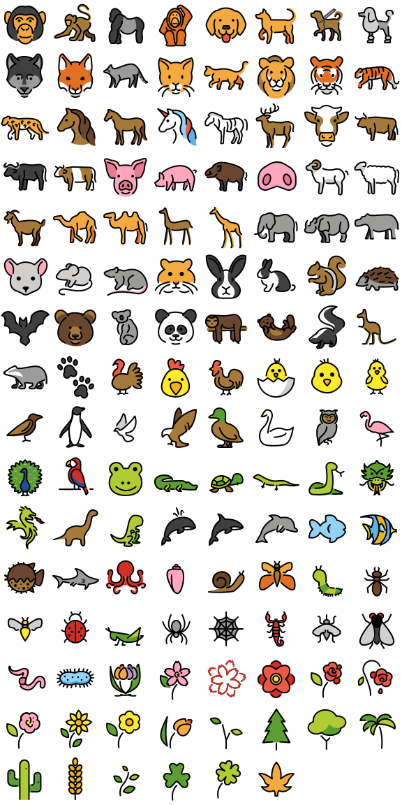](png/animals-nature.png)

Merged image: [png/animals-nature.png](png/animals-nature.png) 
HTML image map: [png/animals-nature.html](png/animals-nature.html) 
CSS sprite sheet: [png/animals-nature.css](png/animals-nature.css) 
CSS sprite example: [png/animals-nature-css.html](png/animals-nature-css.html) 
Custom JSON: [png/animals-nature.json](png/animals-nature.json)

## 🍇 food-drink 72x72

Merged image: [png/food-drink.png](png/food-drink.png) 
HTML image map: [png/food-drink.html](png/food-drink.html) 
CSS sprite sheet: [png/food-drink.css](png/food-drink.css) 
CSS sprite example: [png/food-drink-css.html](png/food-drink-css.html) 
Custom JSON: [png/food-drink.json](png/food-drink.json)

## 🌍 travel-places 72x72

[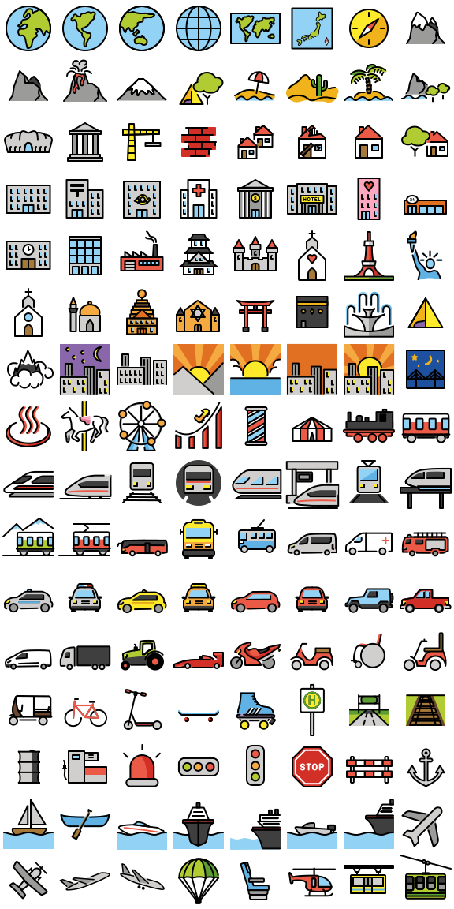](png/travel-places.png)

Merged image: [png/travel-places.png](png/travel-places.png) 
HTML image map: [png/travel-places.html](png/travel-places.html) 
CSS sprite sheet: [png/travel-places.css](png/travel-places.css) 
CSS sprite example: [png/travel-places-css.html](png/travel-places-css.html) 
Custom JSON: [png/travel-places.json](png/travel-places.json)

[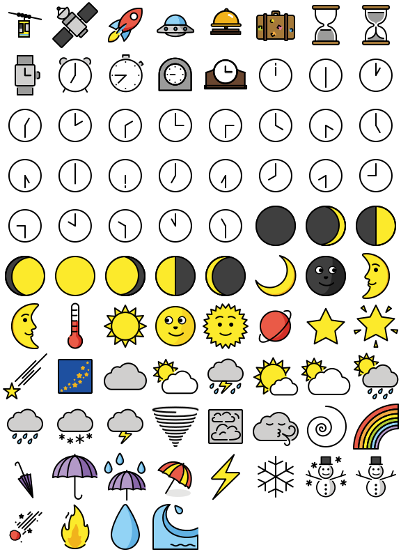](png/travel-places-1.png)

Merged image: [png/travel-places-1.png](png/travel-places-1.png) 
HTML image map: [png/travel-places-1.html](png/travel-places-1.html) 
CSS sprite sheet: [png/travel-places-1.css](png/travel-places-1.css) 
CSS sprite example: [png/travel-places-1-css.html](png/travel-places-1-css.html) 
Custom JSON: [png/travel-places-1.json](png/travel-places-1.json)

## 🎃 activities 72x72

[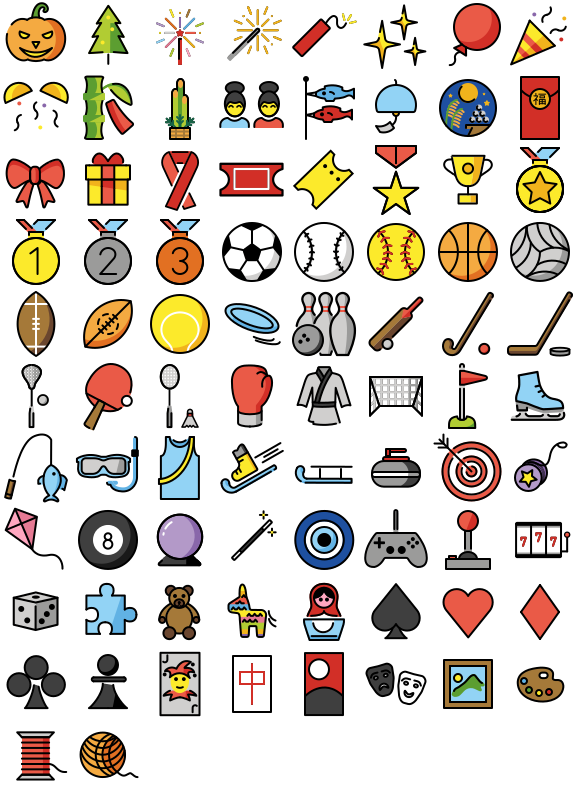](png/activities.png)

Merged image: [png/activities.png](png/activities.png) 
HTML image map: [png/activities.html](png/activities.html) 
CSS sprite sheet: [png/activities.css](png/activities.css) 
CSS sprite example: [png/activities-css.html](png/activities-css.html) 
Custom JSON: [png/activities.json](png/activities.json)

## 👓 objects 72x72

[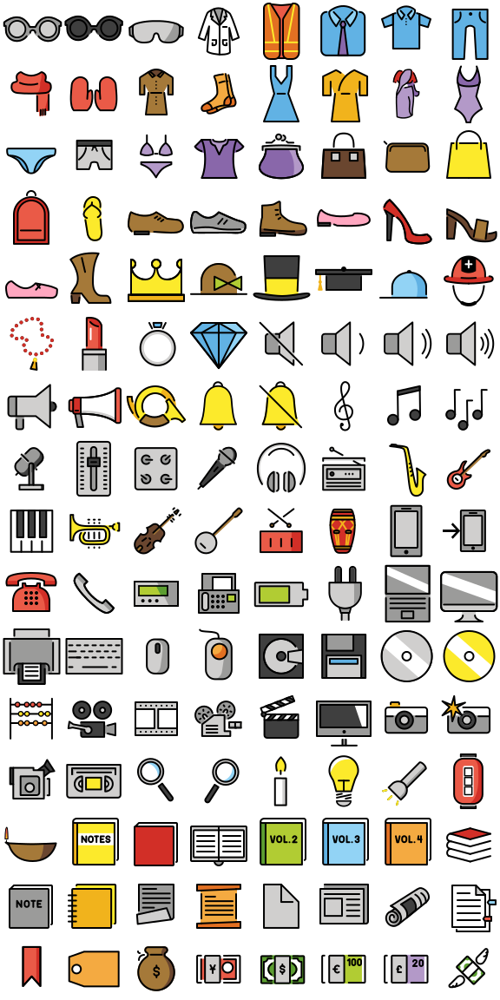](png/objects.png)

Merged image: [png/objects.png](png/objects.png) 
HTML image map: [png/objects.html](png/objects.html) 
CSS sprite sheet: [png/objects.css](png/objects.css) 
CSS sprite example: [png/objects-css.html](png/objects-css.html) 
Custom JSON: [png/objects.json](png/objects.json)

[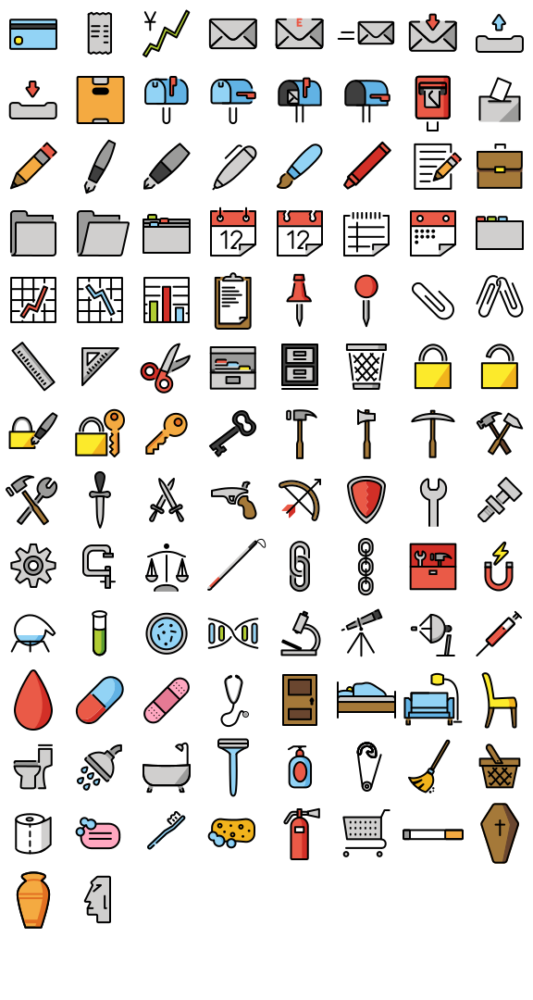](png/objects-1.png)

Merged image: [png/objects-1.png](png/objects-1.png) 
HTML image map: [png/objects-1.html](png/objects-1.html) 
CSS sprite sheet: [png/objects-1.css](png/objects-1.css) 
CSS sprite example: [png/objects-1-css.html](png/objects-1-css.html) 
Custom JSON: [png/objects-1.json](png/objects-1.json)

## 🏧 symbols 72x72

[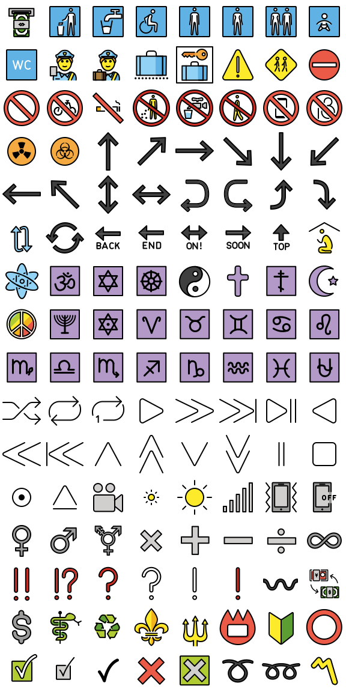](png/symbols.png)

Merged image: [png/symbols.png](png/symbols.png) 
HTML image map: [png/symbols.html](png/symbols.html) 
CSS sprite sheet: [png/symbols.css](png/symbols.css) 
CSS sprite example: [png/symbols-css.html](png/symbols-css.html) 
Custom JSON: [png/symbols.json](png/symbols.json)

[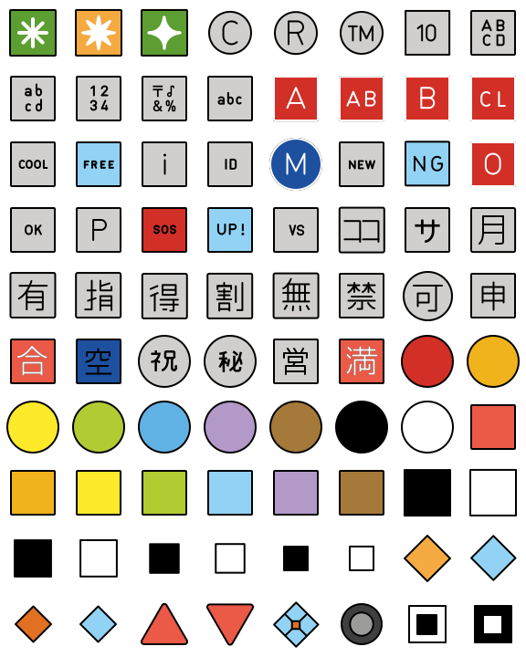](png/symbols-1.png)

Merged image: [png/symbols-1.png](png/symbols-1.png) 
HTML image map: [png/symbols-1.html](png/symbols-1.html) 
CSS sprite sheet: [png/symbols-1.css](png/symbols-1.css) 
CSS sprite example: [png/symbols-1-css.html](png/symbols-1-css.html) 
Custom JSON: [png/symbols-1.json](png/symbols-1.json)

## 🦄 extras-openmoji 72x72

[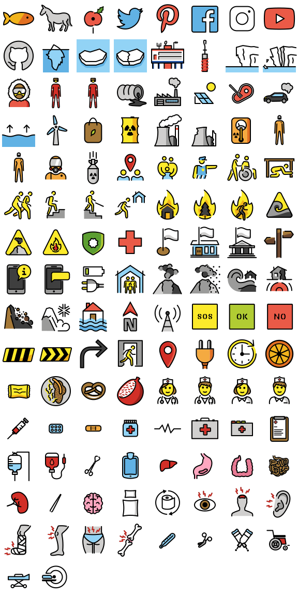](png/extras-openmoji.png)

Merged image: [png/extras-openmoji.png](png/extras-openmoji.png) 
HTML image map: [png/extras-openmoji.html](png/extras-openmoji.html) 
CSS sprite sheet: [png/extras-openmoji.css](png/extras-openmoji.css) 
CSS sprite example: [png/extras-openmoji-css.html](png/extras-openmoji-css.html) 
Custom JSON: [png/extras-openmoji.json](png/extras-openmoji.json)

[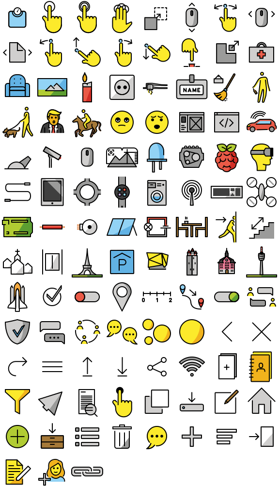](png/extras-openmoji-1.png)

Merged image: [png/extras-openmoji-1.png](png/extras-openmoji-1.png) 
HTML image map: [png/extras-openmoji-1.html](png/extras-openmoji-1.html) 
CSS sprite sheet: [png/extras-openmoji-1.css](png/extras-openmoji-1.css) 
CSS sprite example: [png/extras-openmoji-1-css.html](png/extras-openmoji-1-css.html) 
Custom JSON: [png/extras-openmoji-1.json](png/extras-openmoji-1.json)

## ℹ About

Images licensed under [CC-BY-SA 4.0](https://creativecommons.org/licenses/by-sa/4.0/legalcode). 
Emojis by [OpenMoji.org](https://openmoji.org/).

Improve this page via [GitHub](https://github.com/axelpale/openmoji-sprites).
