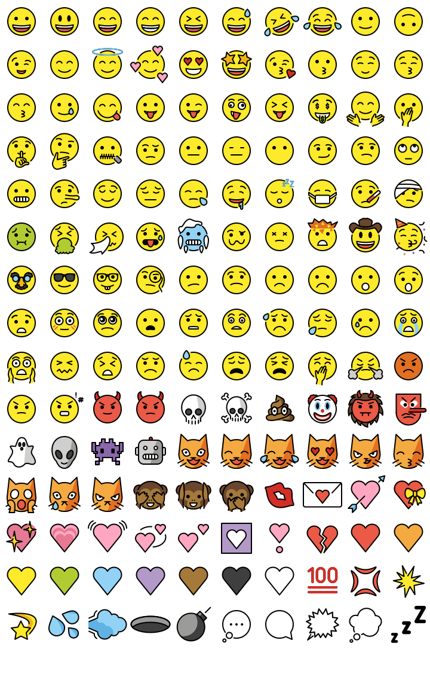
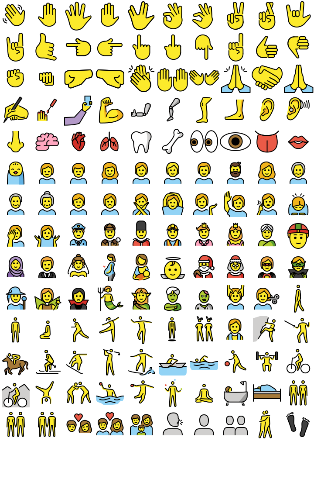
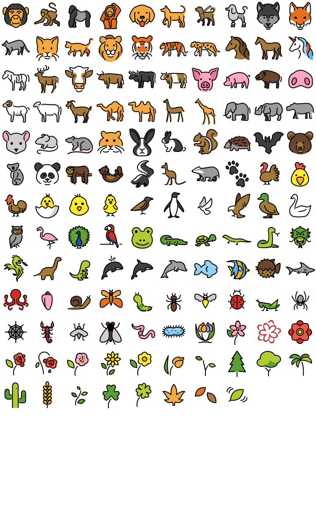
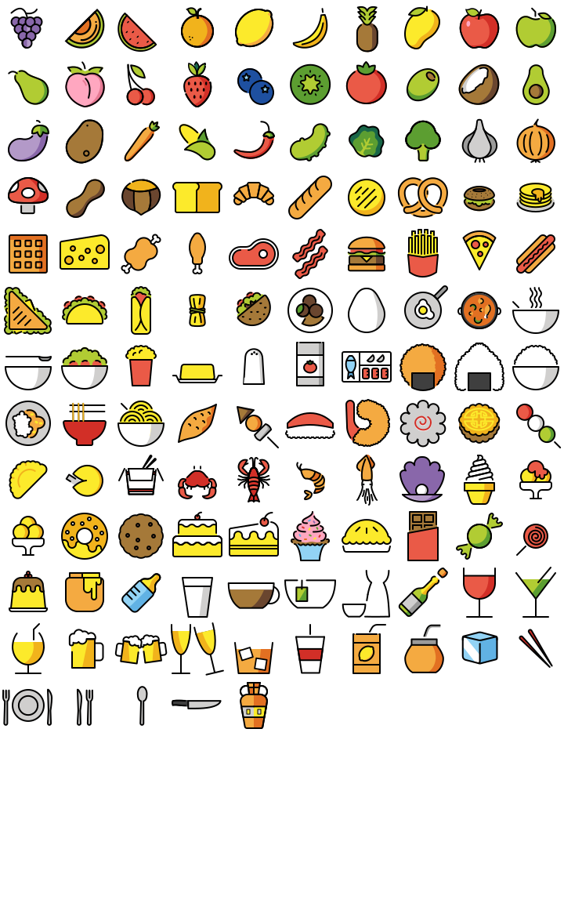
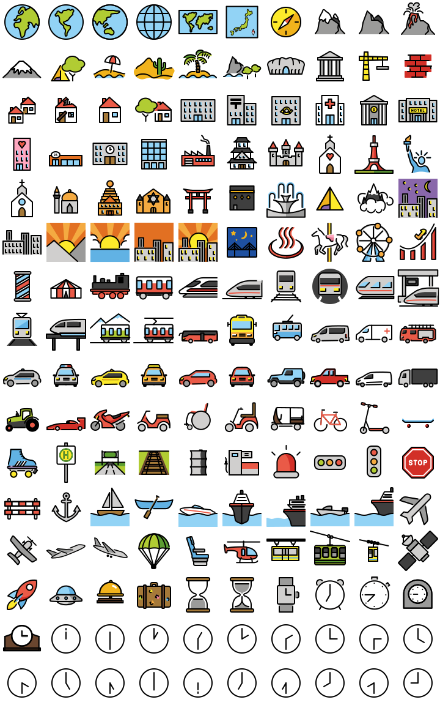
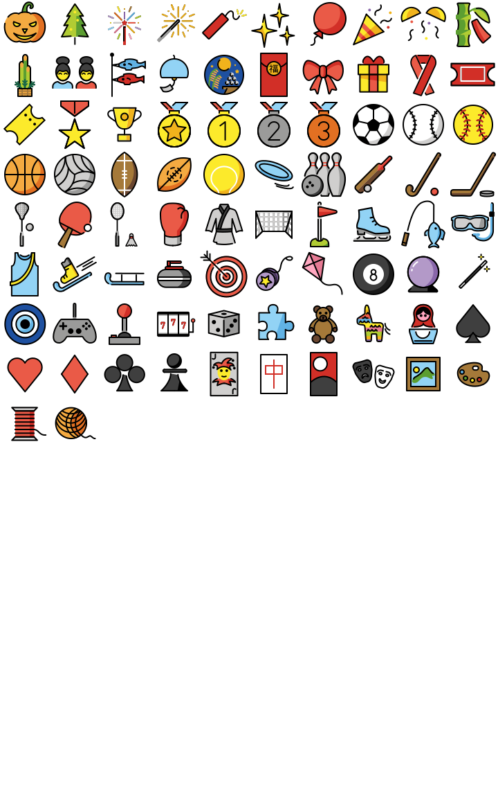
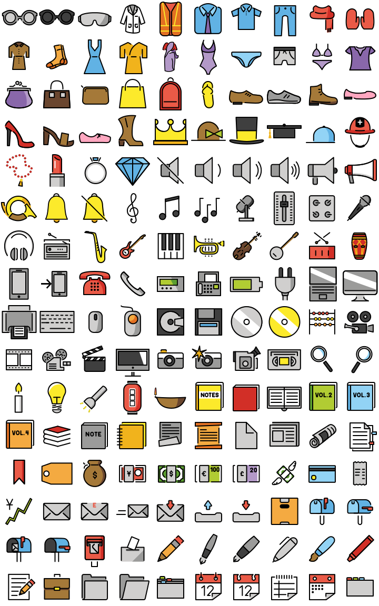
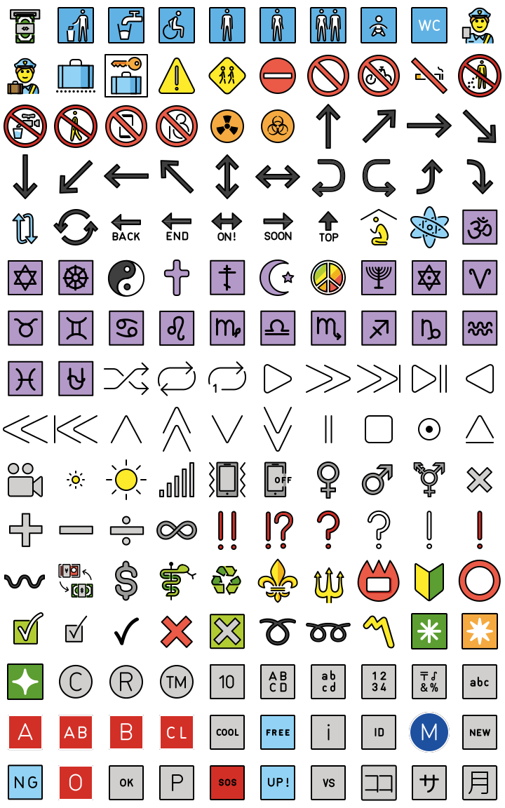
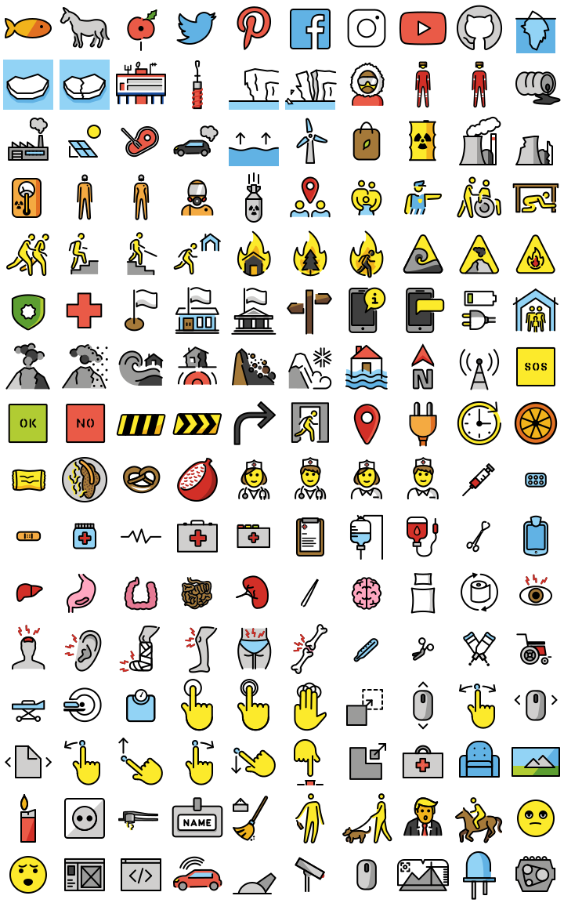

This project is a work-in-progress attempt to create a practical set of sprite sheets for [OpenMoji.org](https://openmoji.org/) emojis. The sprite sheets presented here were generated with [axelpale/openmoji-spritemap-generator](https://github.com/axelpale/openmoji-spritemap-generator) and are licensed under [CC-BY-SA 4.0](https://creativecommons.org/licenses/by-sa/4.0/legalcode).

## smileys-emotion 72x72

*   Merged image: [smileys-emotion.png](smileys-emotion.png)
*   HTML image map: [smileys-emotion.html](smileys-emotion.html)
*   CSS sprite sheet: [smileys-emotion.css](smileys-emotion.css)
*   CSS sprite example: [smileys-emotion-css.html](smileys-emotion-css.html)
*   Custom JSON: [smileys-emotion.json](smileys-emotion.json)

## people-body 72x72

*   Merged image: [people-body.png](people-body.png)
*   HTML image map: [people-body.html](people-body.html)
*   CSS sprite sheet: [people-body.css](people-body.css)
*   CSS sprite example: [people-body-css.html](people-body-css.html)
*   Custom JSON: [people-body.json](people-body.json)

## animals-nature 72x72

*   Merged image: [animals-nature.png](animals-nature.png)
*   HTML image map: [animals-nature.html](animals-nature.html)
*   CSS sprite sheet: [animals-nature.css](animals-nature.css)
*   CSS sprite example: [animals-nature-css.html](animals-nature-css.html)
*   Custom JSON: [animals-nature.json](animals-nature.json)

## food-drink 72x72

*   Merged image: [food-drink.png](food-drink.png)
*   HTML image map: [food-drink.html](food-drink.html)
*   CSS sprite sheet: [food-drink.css](food-drink.css)
*   CSS sprite example: [food-drink-css.html](food-drink-css.html)
*   Custom JSON: [food-drink.json](food-drink.json)

## travel-places 72x72

*   Merged image: [travel-places.png](travel-places.png)
*   HTML image map: [travel-places.html](travel-places.html)
*   CSS sprite sheet: [travel-places.css](travel-places.css)
*   CSS sprite example: [travel-places-css.html](travel-places-css.html)
*   Custom JSON: [travel-places.json](travel-places.json)

## activities 72x72

*   Merged image: [activities.png](activities.png)
*   HTML image map: [activities.html](activities.html)
*   CSS sprite sheet: [activities.css](activities.css)
*   CSS sprite example: [activities-css.html](activities-css.html)
*   Custom JSON: [activities.json](activities.json)

## objects 72x72

*   Merged image: [objects.png](objects.png)
*   HTML image map: [objects.html](objects.html)
*   CSS sprite sheet: [objects.css](objects.css)
*   CSS sprite example: [objects-css.html](objects-css.html)
*   Custom JSON: [objects.json](objects.json)

## symbols 72x72

*   Merged image: [symbols.png](symbols.png)
*   HTML image map: [symbols.html](symbols.html)
*   CSS sprite sheet: [symbols.css](symbols.css)
*   CSS sprite example: [symbols-css.html](symbols-css.html)
*   Custom JSON: [symbols.json](symbols.json)

## extras-openmoji 72x72

*   Merged image: [extras-openmoji.png](extras-openmoji.png)
*   HTML image map: [extras-openmoji.html](extras-openmoji.html)
*   CSS sprite sheet: [extras-openmoji.css](extras-openmoji.css)
*   CSS sprite example: [extras-openmoji-css.html](extras-openmoji-css.html)
*   Custom JSON: [extras-openmoji.json](extras-openmoji.json)

## About

Images licensed under [CC-BY-SA 4.0](https://creativecommons.org/licenses/by-sa/4.0/legalcode).

Emojis by [OpenMoji.org](https://openmoji.org/).

Improve this page via [GitHub](https://github.com/axelpale/openmoji-sprites).
