<link href="https://fonts.googleapis.com/css?family=Source+Sans+Pro:400,600,700" rel="stylesheet">

This project is a work-in-progress attempt to create a practical set of
sprite sheets for [OpenMoji.org](https://openmoji.org/) emojis. The sprite sheets
presented here were generated with
[axelpale/openmoji-spritemap-generator](https://github.com/axelpale/openmoji-spritemap-generator)
and are licensed under [CC-BY-SA 4.0](https://creativecommons.org/licenses/by-sa/4.0/legalcode).

* [😀 smileys-emotion](#-smileys-emotion)
* [👋 people-body](#-people-body)
* [🐵 animals-nature](#-animals-nature)
* [🍇 food-drink](#-food-drink)
* [🌍 travel-places](#-travel-places)
* [🎃 activities](#-activities)
* [👓 objects](#-objects)
* [🏧 symbols](#-symbols)
* [🏁 flags](#-flags)
* [🦄 extras-openmoji](#-extras-openmoji)
* [ℹ about](#ℹ-about)

## 😀 smileys-emotion

[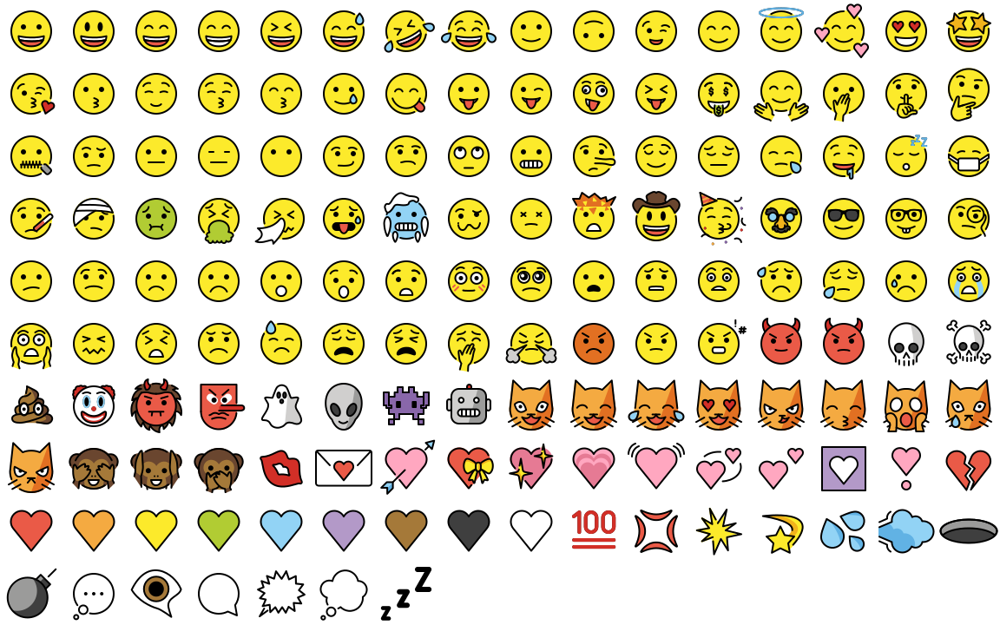](png/smileys-emotion-00.png)

  
<strong>PNG 72px sheets</strong>

  Merged image: <a href="png/smileys-emotion-00.png">smileys-emotion-00.png</a> 
  HTML image map: <a href="png/smileys-emotion-00.html">smileys-emotion-00.html</a> 
  CSS sprite sheet: <a href="png/smileys-emotion-00.css">smileys-emotion-00.css</a> 
  CSS sprite example: <a href="png/smileys-emotion-00-css.html">smileys-emotion-00-css.html</a> 
  Custom JSON: <a href="png/smileys-emotion-00.json">smileys-emotion-00.json</a>

  
<strong>SVG sheets</strong>

  Merged image: <a href="svg/smileys-emotion-00.svg">smileys-emotion-00.svg</a> 
  HTML image map: <a href="svg/smileys-emotion-00.html">smileys-emotion-00.html</a> 
  CSS sprite sheet: <a href="svg/smileys-emotion-00.css">smileys-emotion-00.css</a> 
  CSS sprite example: <a href="svg/smileys-emotion-00-css.html">smileys-emotion-00-css.html</a> 
  Custom JSON: <a href="svg/smileys-emotion-00.json">smileys-emotion-00.json</a>

  

## 👋 people-body

[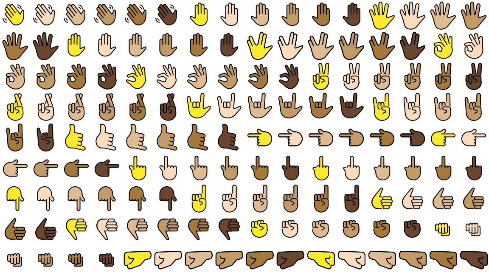](png/people-body-00.png)

  
<strong>PNG 72px sheets</strong>

  Merged image: <a href="png/people-body-00.png">people-body-00.png</a> 
  HTML image map: <a href="png/people-body-00.html">people-body-00.html</a> 
  CSS sprite sheet: <a href="png/people-body-00.css">people-body-00.css</a> 
  CSS sprite example: <a href="png/people-body-00-css.html">people-body-00-css.html</a> 
  Custom JSON: <a href="png/people-body-00.json">people-body-00.json</a>

  
<strong>SVG sheets</strong>

  Merged image: <a href="svg/people-body-00.svg">people-body-00.svg</a> 
  HTML image map: <a href="svg/people-body-00.html">people-body-00.html</a> 
  CSS sprite sheet: <a href="svg/people-body-00.css">people-body-00.css</a> 
  CSS sprite example: <a href="svg/people-body-00-css.html">people-body-00-css.html</a> 
  Custom JSON: <a href="svg/people-body-00.json">people-body-00.json</a>

  

[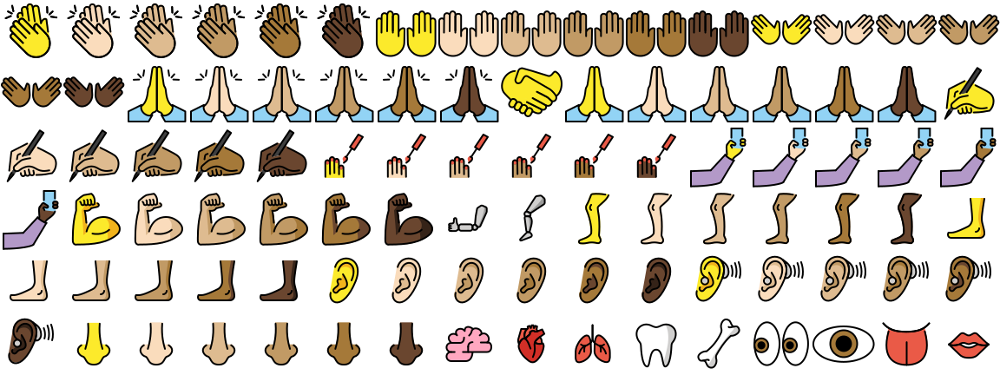](png/people-body-01.png)

  
<strong>PNG 72px sheets</strong>

  Merged image: <a href="png/people-body-01.png">people-body-01.png</a> 
  HTML image map: <a href="png/people-body-01.html">people-body-01.html</a> 
  CSS sprite sheet: <a href="png/people-body-01.css">people-body-01.css</a> 
  CSS sprite example: <a href="png/people-body-01-css.html">people-body-01-css.html</a> 
  Custom JSON: <a href="png/people-body-01.json">people-body-01.json</a>

  
<strong>SVG sheets</strong>

  Merged image: <a href="svg/people-body-01.svg">people-body-01.svg</a> 
  HTML image map: <a href="svg/people-body-01.html">people-body-01.html</a> 
  CSS sprite sheet: <a href="svg/people-body-01.css">people-body-01.css</a> 
  CSS sprite example: <a href="svg/people-body-01-css.html">people-body-01-css.html</a> 
  Custom JSON: <a href="svg/people-body-01.json">people-body-01.json</a>

  

[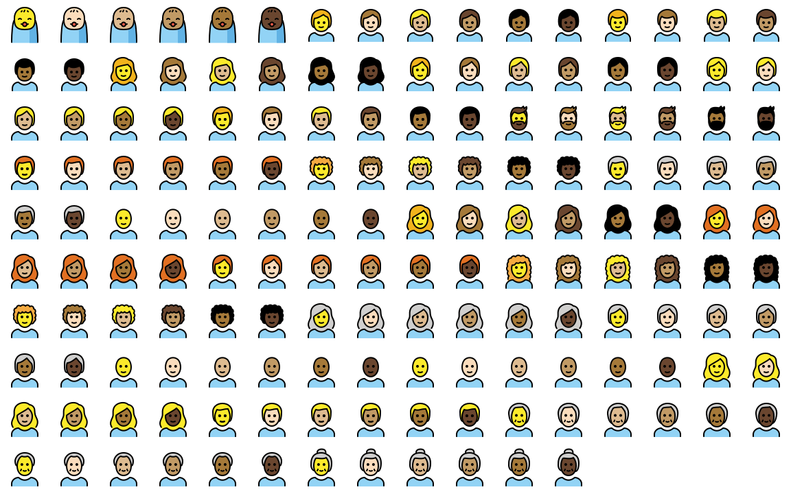](png/people-body-02.png)

  
<strong>PNG 72px sheets</strong>

  Merged image: <a href="png/people-body-02.png">people-body-02.png</a> 
  HTML image map: <a href="png/people-body-02.html">people-body-02.html</a> 
  CSS sprite sheet: <a href="png/people-body-02.css">people-body-02.css</a> 
  CSS sprite example: <a href="png/people-body-02-css.html">people-body-02-css.html</a> 
  Custom JSON: <a href="png/people-body-02.json">people-body-02.json</a>

  
<strong>SVG sheets</strong>

  Merged image: <a href="svg/people-body-02.svg">people-body-02.svg</a> 
  HTML image map: <a href="svg/people-body-02.html">people-body-02.html</a> 
  CSS sprite sheet: <a href="svg/people-body-02.css">people-body-02.css</a> 
  CSS sprite example: <a href="svg/people-body-02-css.html">people-body-02-css.html</a> 
  Custom JSON: <a href="svg/people-body-02.json">people-body-02.json</a>

  

[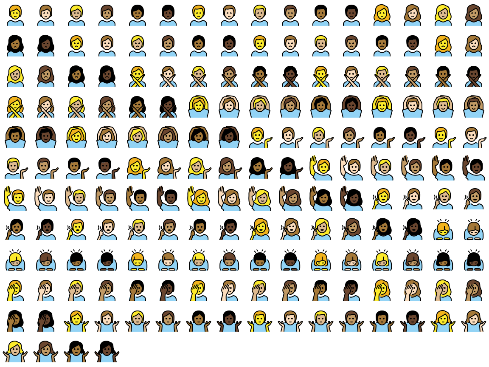](png/people-body-03.png)

  
<strong>PNG 72px sheets</strong>

  Merged image: <a href="png/people-body-03.png">people-body-03.png</a> 
  HTML image map: <a href="png/people-body-03.html">people-body-03.html</a> 
  CSS sprite sheet: <a href="png/people-body-03.css">people-body-03.css</a> 
  CSS sprite example: <a href="png/people-body-03-css.html">people-body-03-css.html</a> 
  Custom JSON: <a href="png/people-body-03.json">people-body-03.json</a>

  
<strong>SVG sheets</strong>

  Merged image: <a href="svg/people-body-03.svg">people-body-03.svg</a> 
  HTML image map: <a href="svg/people-body-03.html">people-body-03.html</a> 
  CSS sprite sheet: <a href="svg/people-body-03.css">people-body-03.css</a> 
  CSS sprite example: <a href="svg/people-body-03-css.html">people-body-03-css.html</a> 
  Custom JSON: <a href="svg/people-body-03.json">people-body-03.json</a>

  

[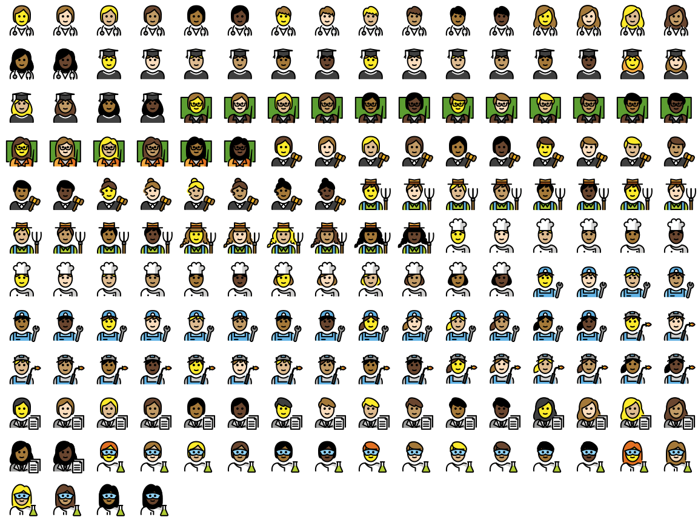](png/people-body-04.png)

  
<strong>PNG 72px sheets</strong>

  Merged image: <a href="png/people-body-04.png">people-body-04.png</a> 
  HTML image map: <a href="png/people-body-04.html">people-body-04.html</a> 
  CSS sprite sheet: <a href="png/people-body-04.css">people-body-04.css</a> 
  CSS sprite example: <a href="png/people-body-04-css.html">people-body-04-css.html</a> 
  Custom JSON: <a href="png/people-body-04.json">people-body-04.json</a>

  
<strong>SVG sheets</strong>

  Merged image: <a href="svg/people-body-04.svg">people-body-04.svg</a> 
  HTML image map: <a href="svg/people-body-04.html">people-body-04.html</a> 
  CSS sprite sheet: <a href="svg/people-body-04.css">people-body-04.css</a> 
  CSS sprite example: <a href="svg/people-body-04-css.html">people-body-04-css.html</a> 
  Custom JSON: <a href="svg/people-body-04.json">people-body-04.json</a>

  

[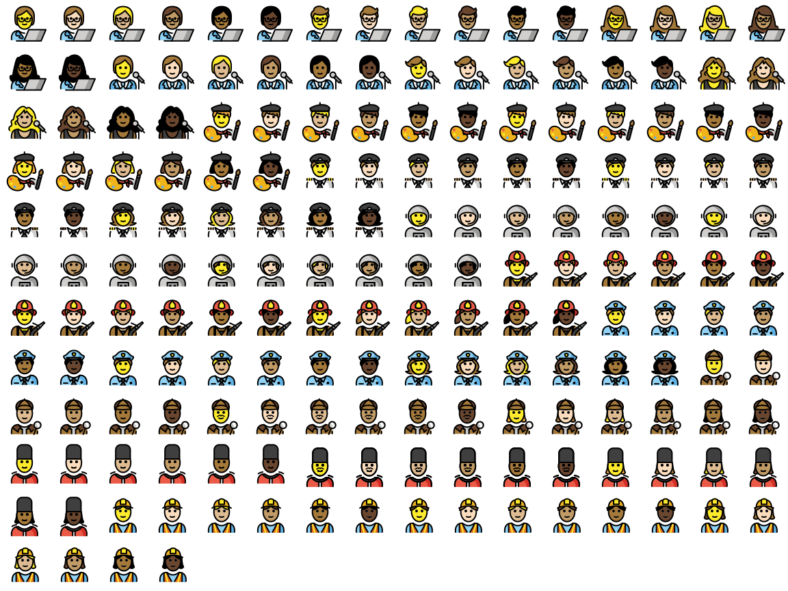](png/people-body-05.png)

  
<strong>PNG 72px sheets</strong>

  Merged image: <a href="png/people-body-05.png">people-body-05.png</a> 
  HTML image map: <a href="png/people-body-05.html">people-body-05.html</a> 
  CSS sprite sheet: <a href="png/people-body-05.css">people-body-05.css</a> 
  CSS sprite example: <a href="png/people-body-05-css.html">people-body-05-css.html</a> 
  Custom JSON: <a href="png/people-body-05.json">people-body-05.json</a>

  
<strong>SVG sheets</strong>

  Merged image: <a href="svg/people-body-05.svg">people-body-05.svg</a> 
  HTML image map: <a href="svg/people-body-05.html">people-body-05.html</a> 
  CSS sprite sheet: <a href="svg/people-body-05.css">people-body-05.css</a> 
  CSS sprite example: <a href="svg/people-body-05-css.html">people-body-05-css.html</a> 
  Custom JSON: <a href="svg/people-body-05.json">people-body-05.json</a>

  

[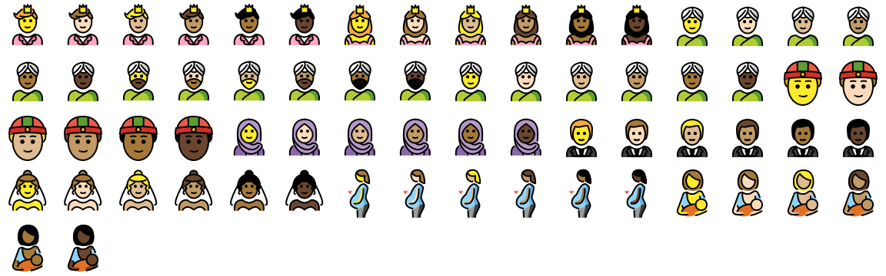](png/people-body-06.png)

  
<strong>PNG 72px sheets</strong>

  Merged image: <a href="png/people-body-06.png">people-body-06.png</a> 
  HTML image map: <a href="png/people-body-06.html">people-body-06.html</a> 
  CSS sprite sheet: <a href="png/people-body-06.css">people-body-06.css</a> 
  CSS sprite example: <a href="png/people-body-06-css.html">people-body-06-css.html</a> 
  Custom JSON: <a href="png/people-body-06.json">people-body-06.json</a>

  
<strong>SVG sheets</strong>

  Merged image: <a href="svg/people-body-06.svg">people-body-06.svg</a> 
  HTML image map: <a href="svg/people-body-06.html">people-body-06.html</a> 
  CSS sprite sheet: <a href="svg/people-body-06.css">people-body-06.css</a> 
  CSS sprite example: <a href="svg/people-body-06-css.html">people-body-06-css.html</a> 
  Custom JSON: <a href="svg/people-body-06.json">people-body-06.json</a>

  

[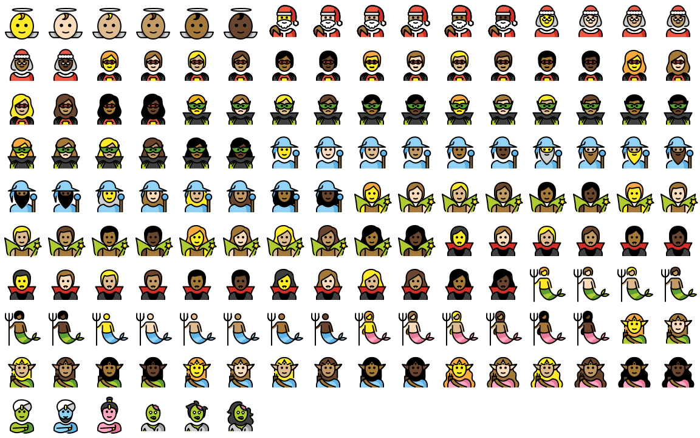](png/people-body-07.png)

  
<strong>PNG 72px sheets</strong>

  Merged image: <a href="png/people-body-07.png">people-body-07.png</a> 
  HTML image map: <a href="png/people-body-07.html">people-body-07.html</a> 
  CSS sprite sheet: <a href="png/people-body-07.css">people-body-07.css</a> 
  CSS sprite example: <a href="png/people-body-07-css.html">people-body-07-css.html</a> 
  Custom JSON: <a href="png/people-body-07.json">people-body-07.json</a>

  
<strong>SVG sheets</strong>

  Merged image: <a href="svg/people-body-07.svg">people-body-07.svg</a> 
  HTML image map: <a href="svg/people-body-07.html">people-body-07.html</a> 
  CSS sprite sheet: <a href="svg/people-body-07.css">people-body-07.css</a> 
  CSS sprite example: <a href="svg/people-body-07-css.html">people-body-07-css.html</a> 
  Custom JSON: <a href="svg/people-body-07.json">people-body-07.json</a>

  

[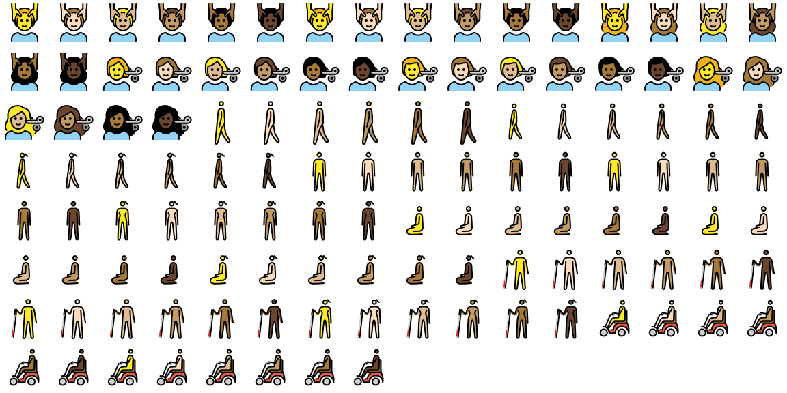](png/people-body-08.png)

  
<strong>PNG 72px sheets</strong>

  Merged image: <a href="png/people-body-08.png">people-body-08.png</a> 
  HTML image map: <a href="png/people-body-08.html">people-body-08.html</a> 
  CSS sprite sheet: <a href="png/people-body-08.css">people-body-08.css</a> 
  CSS sprite example: <a href="png/people-body-08-css.html">people-body-08-css.html</a> 
  Custom JSON: <a href="png/people-body-08.json">people-body-08.json</a>

  
<strong>SVG sheets</strong>

  Merged image: <a href="svg/people-body-08.svg">people-body-08.svg</a> 
  HTML image map: <a href="svg/people-body-08.html">people-body-08.html</a> 
  CSS sprite sheet: <a href="svg/people-body-08.css">people-body-08.css</a> 
  CSS sprite example: <a href="svg/people-body-08-css.html">people-body-08-css.html</a> 
  Custom JSON: <a href="svg/people-body-08.json">people-body-08.json</a>

  

[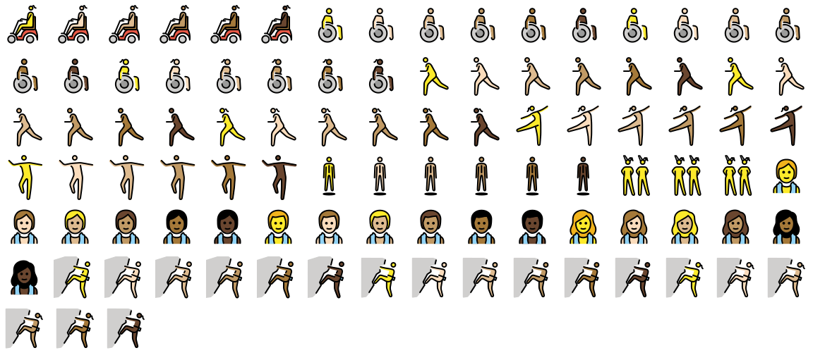](png/people-body-09.png)

  
<strong>PNG 72px sheets</strong>

  Merged image: <a href="png/people-body-09.png">people-body-09.png</a> 
  HTML image map: <a href="png/people-body-09.html">people-body-09.html</a> 
  CSS sprite sheet: <a href="png/people-body-09.css">people-body-09.css</a> 
  CSS sprite example: <a href="png/people-body-09-css.html">people-body-09-css.html</a> 
  Custom JSON: <a href="png/people-body-09.json">people-body-09.json</a>

  
<strong>SVG sheets</strong>

  Merged image: <a href="svg/people-body-09.svg">people-body-09.svg</a> 
  HTML image map: <a href="svg/people-body-09.html">people-body-09.html</a> 
  CSS sprite sheet: <a href="svg/people-body-09.css">people-body-09.css</a> 
  CSS sprite example: <a href="svg/people-body-09-css.html">people-body-09-css.html</a> 
  Custom JSON: <a href="svg/people-body-09.json">people-body-09.json</a>

  

[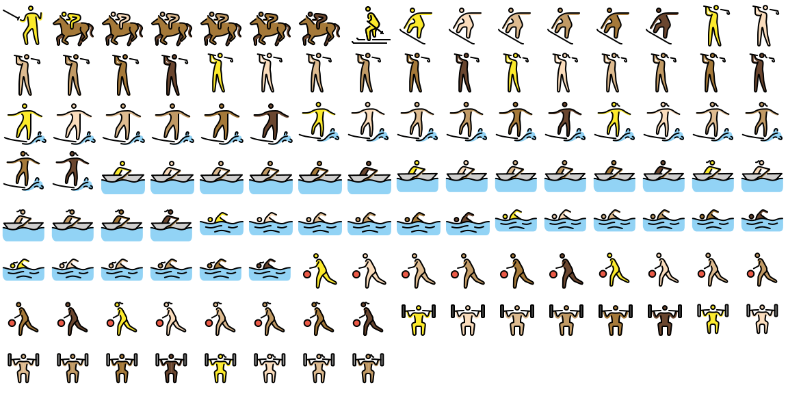](png/people-body-10.png)

  
<strong>PNG 72px sheets</strong>

  Merged image: <a href="png/people-body-10.png">people-body-10.png</a> 
  HTML image map: <a href="png/people-body-10.html">people-body-10.html</a> 
  CSS sprite sheet: <a href="png/people-body-10.css">people-body-10.css</a> 
  CSS sprite example: <a href="png/people-body-10-css.html">people-body-10-css.html</a> 
  Custom JSON: <a href="png/people-body-10.json">people-body-10.json</a>

  
<strong>SVG sheets</strong>

  Merged image: <a href="svg/people-body-10.svg">people-body-10.svg</a> 
  HTML image map: <a href="svg/people-body-10.html">people-body-10.html</a> 
  CSS sprite sheet: <a href="svg/people-body-10.css">people-body-10.css</a> 
  CSS sprite example: <a href="svg/people-body-10-css.html">people-body-10-css.html</a> 
  Custom JSON: <a href="svg/people-body-10.json">people-body-10.json</a>

  

  
<strong>PNG 72px sheets</strong>

  Merged image: <a href="png/people-body-11.png">people-body-11.png</a> 
  HTML image map: <a href="png/people-body-11.html">people-body-11.html</a> 
  CSS sprite sheet: <a href="png/people-body-11.css">people-body-11.css</a> 
  CSS sprite example: <a href="png/people-body-11-css.html">people-body-11-css.html</a> 
  Custom JSON: <a href="png/people-body-11.json">people-body-11.json</a>

  
<strong>SVG sheets</strong>

  Merged image: <a href="svg/people-body-11.svg">people-body-11.svg</a> 
  HTML image map: <a href="svg/people-body-11.html">people-body-11.html</a> 
  CSS sprite sheet: <a href="svg/people-body-11.css">people-body-11.css</a> 
  CSS sprite example: <a href="svg/people-body-11-css.html">people-body-11-css.html</a> 
  Custom JSON: <a href="svg/people-body-11.json">people-body-11.json</a>

  

  
<strong>PNG 72px sheets</strong>

  Merged image: <a href="png/people-body-12.png">people-body-12.png</a> 
  HTML image map: <a href="png/people-body-12.html">people-body-12.html</a> 
  CSS sprite sheet: <a href="png/people-body-12.css">people-body-12.css</a> 
  CSS sprite example: <a href="png/people-body-12-css.html">people-body-12-css.html</a> 
  Custom JSON: <a href="png/people-body-12.json">people-body-12.json</a>

  
<strong>SVG sheets</strong>

  Merged image: <a href="svg/people-body-12.svg">people-body-12.svg</a> 
  HTML image map: <a href="svg/people-body-12.html">people-body-12.html</a> 
  CSS sprite sheet: <a href="svg/people-body-12.css">people-body-12.css</a> 
  CSS sprite example: <a href="svg/people-body-12-css.html">people-body-12-css.html</a> 
  Custom JSON: <a href="svg/people-body-12.json">people-body-12.json</a>

  

[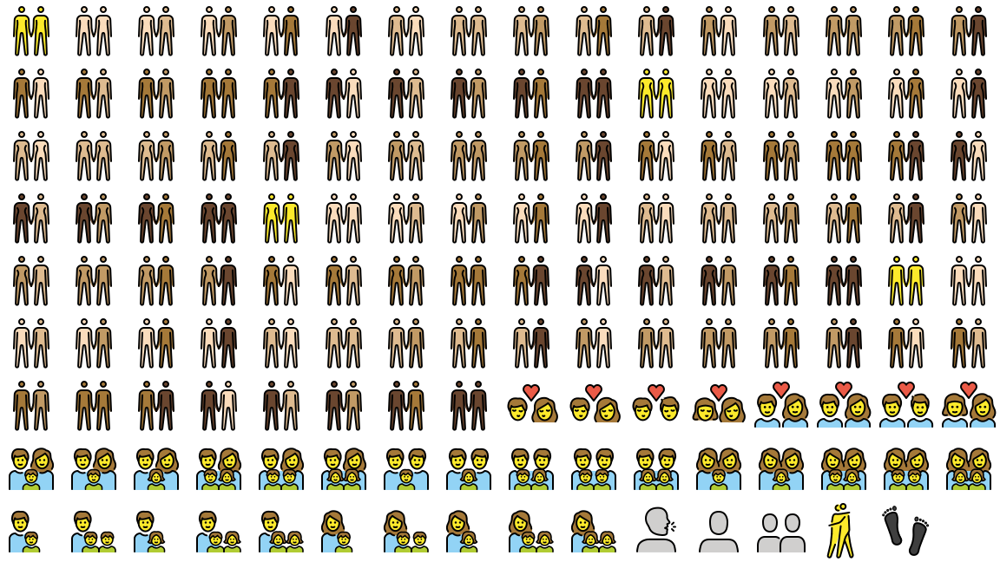](png/people-body-13.png)

  
<strong>PNG 72px sheets</strong>

  Merged image: <a href="png/people-body-13.png">people-body-13.png</a> 
  HTML image map: <a href="png/people-body-13.html">people-body-13.html</a> 
  CSS sprite sheet: <a href="png/people-body-13.css">people-body-13.css</a> 
  CSS sprite example: <a href="png/people-body-13-css.html">people-body-13-css.html</a> 
  Custom JSON: <a href="png/people-body-13.json">people-body-13.json</a>

  
<strong>SVG sheets</strong>

  Merged image: <a href="svg/people-body-13.svg">people-body-13.svg</a> 
  HTML image map: <a href="svg/people-body-13.html">people-body-13.html</a> 
  CSS sprite sheet: <a href="svg/people-body-13.css">people-body-13.css</a> 
  CSS sprite example: <a href="svg/people-body-13-css.html">people-body-13-css.html</a> 
  Custom JSON: <a href="svg/people-body-13.json">people-body-13.json</a>

  

## 🐵 animals-nature

[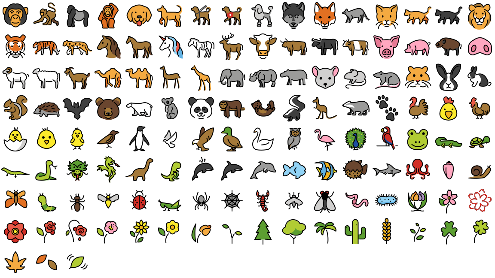](png/animals-nature-00.png)

  
<strong>PNG 72px sheets</strong>

  Merged image: <a href="png/animals-nature-00.png">animals-nature-00.png</a> 
  HTML image map: <a href="png/animals-nature-00.html">animals-nature-00.html</a> 
  CSS sprite sheet: <a href="png/animals-nature-00.css">animals-nature-00.css</a> 
  CSS sprite example: <a href="png/animals-nature-00-css.html">animals-nature-00-css.html</a> 
  Custom JSON: <a href="png/animals-nature-00.json">animals-nature-00.json</a>

  
<strong>SVG sheets</strong>

  Merged image: <a href="svg/animals-nature-00.svg">animals-nature-00.svg</a> 
  HTML image map: <a href="svg/animals-nature-00.html">animals-nature-00.html</a> 
  CSS sprite sheet: <a href="svg/animals-nature-00.css">animals-nature-00.css</a> 
  CSS sprite example: <a href="svg/animals-nature-00-css.html">animals-nature-00-css.html</a> 
  Custom JSON: <a href="svg/animals-nature-00.json">animals-nature-00.json</a>

  

## 🍇 food-drink

[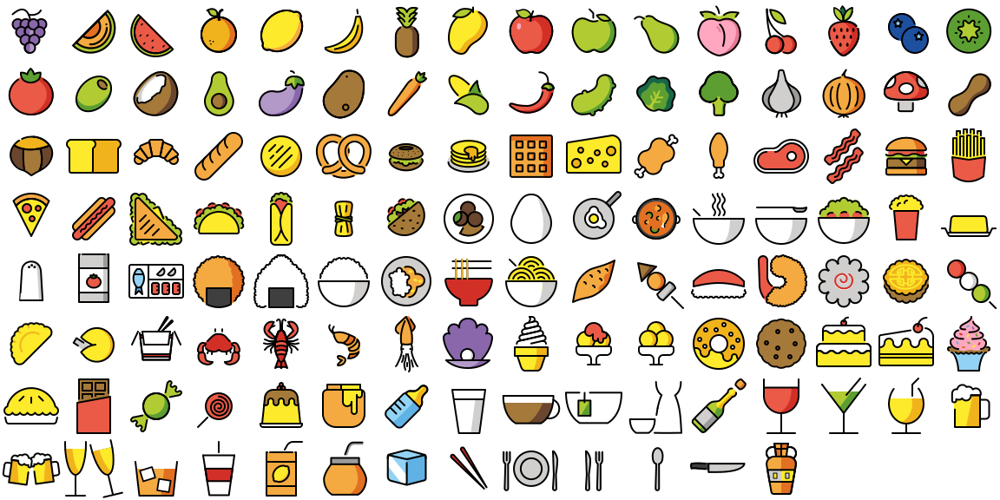](png/food-drink-00.png)

  
<strong>PNG 72px sheets</strong>

  Merged image: <a href="png/food-drink-00.png">food-drink-00.png</a> 
  HTML image map: <a href="png/food-drink-00.html">food-drink-00.html</a> 
  CSS sprite sheet: <a href="png/food-drink-00.css">food-drink-00.css</a> 
  CSS sprite example: <a href="png/food-drink-00-css.html">food-drink-00-css.html</a> 
  Custom JSON: <a href="png/food-drink-00.json">food-drink-00.json</a>

  
<strong>SVG sheets</strong>

  Merged image: <a href="svg/food-drink-00.svg">food-drink-00.svg</a> 
  HTML image map: <a href="svg/food-drink-00.html">food-drink-00.html</a> 
  CSS sprite sheet: <a href="svg/food-drink-00.css">food-drink-00.css</a> 
  CSS sprite example: <a href="svg/food-drink-00-css.html">food-drink-00-css.html</a> 
  Custom JSON: <a href="svg/food-drink-00.json">food-drink-00.json</a>

  

## 🌍 travel-places

[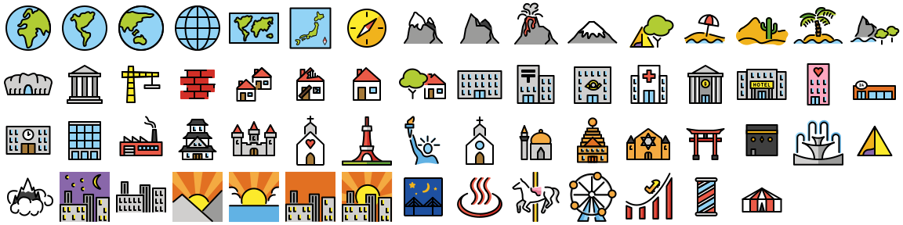](png/travel-places-00.png)

  
<strong>PNG 72px sheets</strong>

  Merged image: <a href="png/travel-places-00.png">travel-places-00.png</a> 
  HTML image map: <a href="png/travel-places-00.html">travel-places-00.html</a> 
  CSS sprite sheet: <a href="png/travel-places-00.css">travel-places-00.css</a> 
  CSS sprite example: <a href="png/travel-places-00-css.html">travel-places-00-css.html</a> 
  Custom JSON: <a href="png/travel-places-00.json">travel-places-00.json</a>

  
<strong>SVG sheets</strong>

  Merged image: <a href="svg/travel-places-00.svg">travel-places-00.svg</a> 
  HTML image map: <a href="svg/travel-places-00.html">travel-places-00.html</a> 
  CSS sprite sheet: <a href="svg/travel-places-00.css">travel-places-00.css</a> 
  CSS sprite example: <a href="svg/travel-places-00-css.html">travel-places-00-css.html</a> 
  Custom JSON: <a href="svg/travel-places-00.json">travel-places-00.json</a>

  

[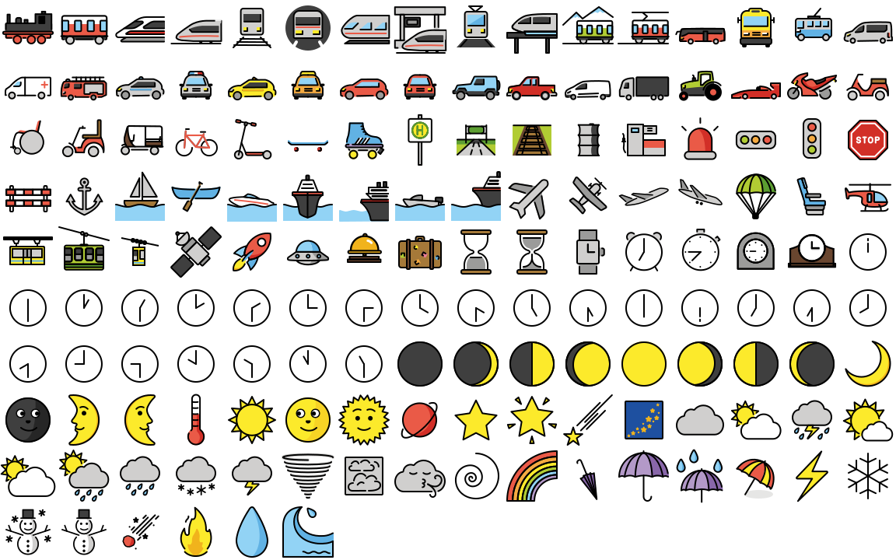](png/travel-places-01.png)

  
<strong>PNG 72px sheets</strong>

  Merged image: <a href="png/travel-places-01.png">travel-places-01.png</a> 
  HTML image map: <a href="png/travel-places-01.html">travel-places-01.html</a> 
  CSS sprite sheet: <a href="png/travel-places-01.css">travel-places-01.css</a> 
  CSS sprite example: <a href="png/travel-places-01-css.html">travel-places-01-css.html</a> 
  Custom JSON: <a href="png/travel-places-01.json">travel-places-01.json</a>

  
<strong>SVG sheets</strong>

  Merged image: <a href="svg/travel-places-01.svg">travel-places-01.svg</a> 
  HTML image map: <a href="svg/travel-places-01.html">travel-places-01.html</a> 
  CSS sprite sheet: <a href="svg/travel-places-01.css">travel-places-01.css</a> 
  CSS sprite example: <a href="svg/travel-places-01-css.html">travel-places-01-css.html</a> 
  Custom JSON: <a href="svg/travel-places-01.json">travel-places-01.json</a>

  

## 🎃 activities

[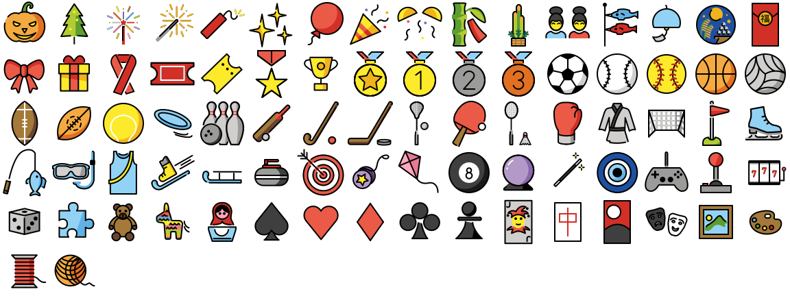](png/activities-00.png)

  
<strong>PNG 72px sheets</strong>

  Merged image: <a href="png/activities-00.png">activities-00.png</a> 
  HTML image map: <a href="png/activities-00.html">activities-00.html</a> 
  CSS sprite sheet: <a href="png/activities-00.css">activities-00.css</a> 
  CSS sprite example: <a href="png/activities-00-css.html">activities-00-css.html</a> 
  Custom JSON: <a href="png/activities-00.json">activities-00.json</a>

  
<strong>SVG sheets</strong>

  Merged image: <a href="svg/activities-00.svg">activities-00.svg</a> 
  HTML image map: <a href="svg/activities-00.html">activities-00.html</a> 
  CSS sprite sheet: <a href="svg/activities-00.css">activities-00.css</a> 
  CSS sprite example: <a href="svg/activities-00-css.html">activities-00-css.html</a> 
  Custom JSON: <a href="svg/activities-00.json">activities-00.json</a>

  

## 👓 objects

[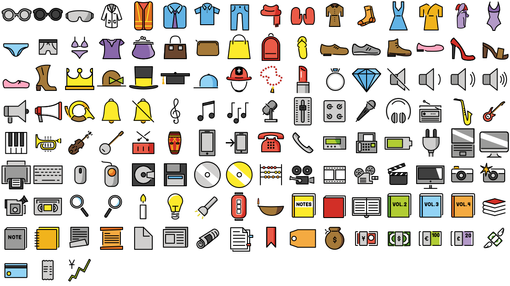](png/objects-00.png)

  
<strong>PNG 72px sheets</strong>

  Merged image: <a href="png/objects-00.png">objects-00.png</a> 
  HTML image map: <a href="png/objects-00.html">objects-00.html</a> 
  CSS sprite sheet: <a href="png/objects-00.css">objects-00.css</a> 
  CSS sprite example: <a href="png/objects-00-css.html">objects-00-css.html</a> 
  Custom JSON: <a href="png/objects-00.json">objects-00.json</a>

  
<strong>SVG sheets</strong>

  Merged image: <a href="svg/objects-00.svg">objects-00.svg</a> 
  HTML image map: <a href="svg/objects-00.html">objects-00.html</a> 
  CSS sprite sheet: <a href="svg/objects-00.css">objects-00.css</a> 
  CSS sprite example: <a href="svg/objects-00-css.html">objects-00-css.html</a> 
  Custom JSON: <a href="svg/objects-00.json">objects-00.json</a>

  

[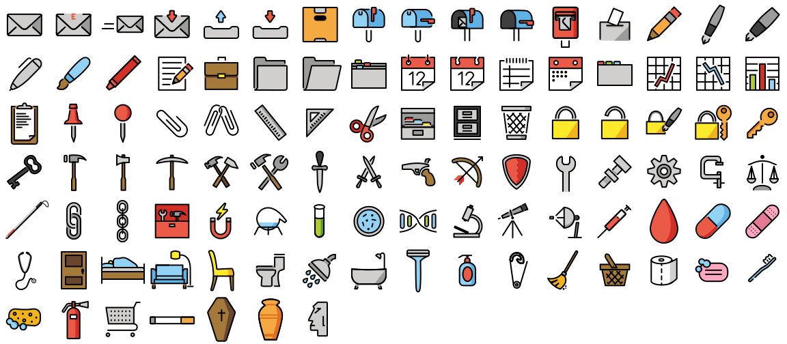](png/objects-01.png)

  
<strong>PNG 72px sheets</strong>

  Merged image: <a href="png/objects-01.png">objects-01.png</a> 
  HTML image map: <a href="png/objects-01.html">objects-01.html</a> 
  CSS sprite sheet: <a href="png/objects-01.css">objects-01.css</a> 
  CSS sprite example: <a href="png/objects-01-css.html">objects-01-css.html</a> 
  Custom JSON: <a href="png/objects-01.json">objects-01.json</a>

  
<strong>SVG sheets</strong>

  Merged image: <a href="svg/objects-01.svg">objects-01.svg</a> 
  HTML image map: <a href="svg/objects-01.html">objects-01.html</a> 
  CSS sprite sheet: <a href="svg/objects-01.css">objects-01.css</a> 
  CSS sprite example: <a href="svg/objects-01-css.html">objects-01-css.html</a> 
  Custom JSON: <a href="svg/objects-01.json">objects-01.json</a>

  

## 🏧 symbols

[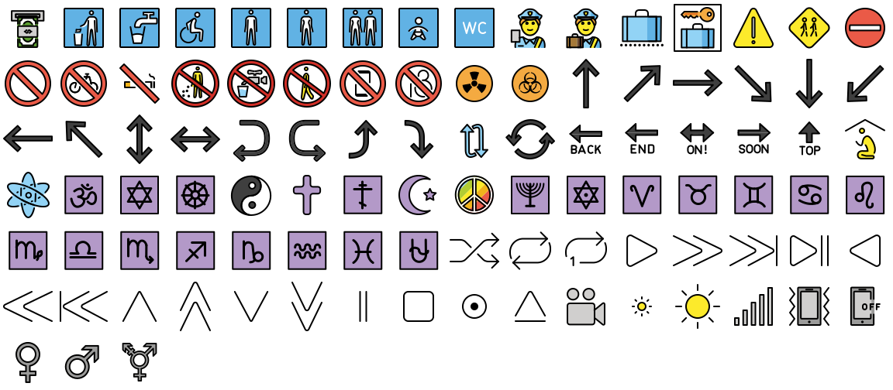](png/symbols-00.png)

  
<strong>PNG 72px sheets</strong>

  Merged image: <a href="png/symbols-00.png">symbols-00.png</a> 
  HTML image map: <a href="png/symbols-00.html">symbols-00.html</a> 
  CSS sprite sheet: <a href="png/symbols-00.css">symbols-00.css</a> 
  CSS sprite example: <a href="png/symbols-00-css.html">symbols-00-css.html</a> 
  Custom JSON: <a href="png/symbols-00.json">symbols-00.json</a>

  
<strong>SVG sheets</strong>

  Merged image: <a href="svg/symbols-00.svg">symbols-00.svg</a> 
  HTML image map: <a href="svg/symbols-00.html">symbols-00.html</a> 
  CSS sprite sheet: <a href="svg/symbols-00.css">symbols-00.css</a> 
  CSS sprite example: <a href="svg/symbols-00-css.html">symbols-00-css.html</a> 
  Custom JSON: <a href="svg/symbols-00.json">symbols-00.json</a>

  

[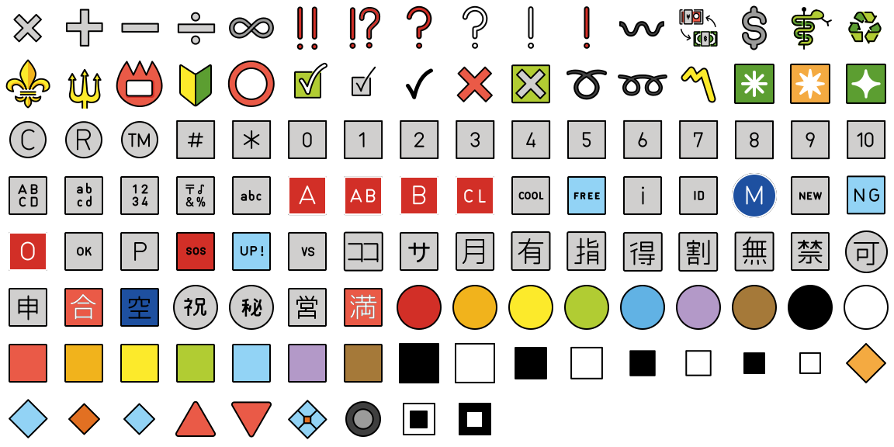](png/symbols-01.png)

  
<strong>PNG 72px sheets</strong>

  Merged image: <a href="png/symbols-01.png">symbols-01.png</a> 
  HTML image map: <a href="png/symbols-01.html">symbols-01.html</a> 
  CSS sprite sheet: <a href="png/symbols-01.css">symbols-01.css</a> 
  CSS sprite example: <a href="png/symbols-01-css.html">symbols-01-css.html</a> 
  Custom JSON: <a href="png/symbols-01.json">symbols-01.json</a>

  
<strong>SVG sheets</strong>

  Merged image: <a href="svg/symbols-01.svg">symbols-01.svg</a> 
  HTML image map: <a href="svg/symbols-01.html">symbols-01.html</a> 
  CSS sprite sheet: <a href="svg/symbols-01.css">symbols-01.css</a> 
  CSS sprite example: <a href="svg/symbols-01-css.html">symbols-01-css.html</a> 
  Custom JSON: <a href="svg/symbols-01.json">symbols-01.json</a>

  

## 🏁 flags

  
<strong>PNG 72px sheets</strong>

  Merged image: <a href="png/flags-00.png">flags-00.png</a> 
  HTML image map: <a href="png/flags-00.html">flags-00.html</a> 
  CSS sprite sheet: <a href="png/flags-00.css">flags-00.css</a> 
  CSS sprite example: <a href="png/flags-00-css.html">flags-00-css.html</a> 
  Custom JSON: <a href="png/flags-00.json">flags-00.json</a>

  
<strong>SVG sheets</strong>

  Merged image: <a href="svg/flags-00.svg">flags-00.svg</a> 
  HTML image map: <a href="svg/flags-00.html">flags-00.html</a> 
  CSS sprite sheet: <a href="svg/flags-00.css">flags-00.css</a> 
  CSS sprite example: <a href="svg/flags-00-css.html">flags-00-css.html</a> 
  Custom JSON: <a href="svg/flags-00.json">flags-00.json</a>

  

[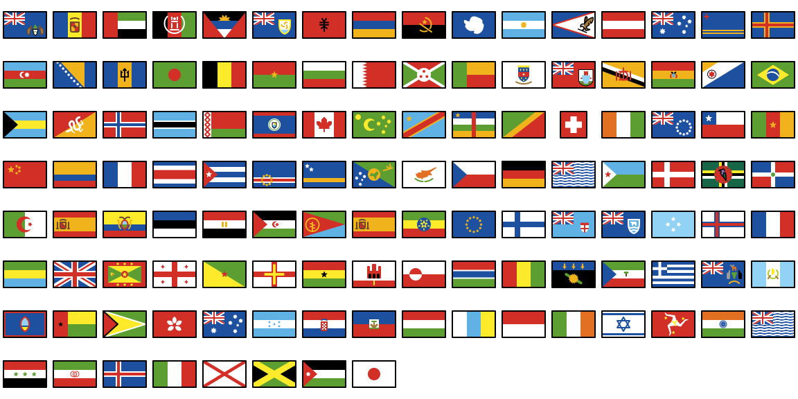](png/flags-01.png)

  
<strong>PNG 72px sheets</strong>

  Merged image: <a href="png/flags-01.png">flags-01.png</a> 
  HTML image map: <a href="png/flags-01.html">flags-01.html</a> 
  CSS sprite sheet: <a href="png/flags-01.css">flags-01.css</a> 
  CSS sprite example: <a href="png/flags-01-css.html">flags-01-css.html</a> 
  Custom JSON: <a href="png/flags-01.json">flags-01.json</a>

  
<strong>SVG sheets</strong>

  Merged image: <a href="svg/flags-01.svg">flags-01.svg</a> 
  HTML image map: <a href="svg/flags-01.html">flags-01.html</a> 
  CSS sprite sheet: <a href="svg/flags-01.css">flags-01.css</a> 
  CSS sprite example: <a href="svg/flags-01-css.html">flags-01-css.html</a> 
  Custom JSON: <a href="svg/flags-01.json">flags-01.json</a>

  

  
<strong>PNG 72px sheets</strong>

  Merged image: <a href="png/flags-02.png">flags-02.png</a> 
  HTML image map: <a href="png/flags-02.html">flags-02.html</a> 
  CSS sprite sheet: <a href="png/flags-02.css">flags-02.css</a> 
  CSS sprite example: <a href="png/flags-02-css.html">flags-02-css.html</a> 
  Custom JSON: <a href="png/flags-02.json">flags-02.json</a>

  
<strong>SVG sheets</strong>

  Merged image: <a href="svg/flags-02.svg">flags-02.svg</a> 
  HTML image map: <a href="svg/flags-02.html">flags-02.html</a> 
  CSS sprite sheet: <a href="svg/flags-02.css">flags-02.css</a> 
  CSS sprite example: <a href="svg/flags-02-css.html">flags-02-css.html</a> 
  Custom JSON: <a href="svg/flags-02.json">flags-02.json</a>

  

  
<strong>PNG 72px sheets</strong>

  Merged image: <a href="png/flags-03.png">flags-03.png</a> 
  HTML image map: <a href="png/flags-03.html">flags-03.html</a> 
  CSS sprite sheet: <a href="png/flags-03.css">flags-03.css</a> 
  CSS sprite example: <a href="png/flags-03-css.html">flags-03-css.html</a> 
  Custom JSON: <a href="png/flags-03.json">flags-03.json</a>

  
<strong>SVG sheets</strong>

  Merged image: <a href="svg/flags-03.svg">flags-03.svg</a> 
  HTML image map: <a href="svg/flags-03.html">flags-03.html</a> 
  CSS sprite sheet: <a href="svg/flags-03.css">flags-03.css</a> 
  CSS sprite example: <a href="svg/flags-03-css.html">flags-03-css.html</a> 
  Custom JSON: <a href="svg/flags-03.json">flags-03.json</a>

  

## 🦄 extras-openmoji

  
<strong>PNG 72px sheets</strong>

  Merged image: <a href="png/extras-openmoji-00.png">extras-openmoji-00.png</a> 
  HTML image map: <a href="png/extras-openmoji-00.html">extras-openmoji-00.html</a> 
  CSS sprite sheet: <a href="png/extras-openmoji-00.css">extras-openmoji-00.css</a> 
  CSS sprite example: <a href="png/extras-openmoji-00-css.html">extras-openmoji-00-css.html</a> 
  Custom JSON: <a href="png/extras-openmoji-00.json">extras-openmoji-00.json</a>

  
<strong>SVG sheets</strong>

  Merged image: <a href="svg/extras-openmoji-00.svg">extras-openmoji-00.svg</a> 
  HTML image map: <a href="svg/extras-openmoji-00.html">extras-openmoji-00.html</a> 
  CSS sprite sheet: <a href="svg/extras-openmoji-00.css">extras-openmoji-00.css</a> 
  CSS sprite example: <a href="svg/extras-openmoji-00-css.html">extras-openmoji-00-css.html</a> 
  Custom JSON: <a href="svg/extras-openmoji-00.json">extras-openmoji-00.json</a>

  

[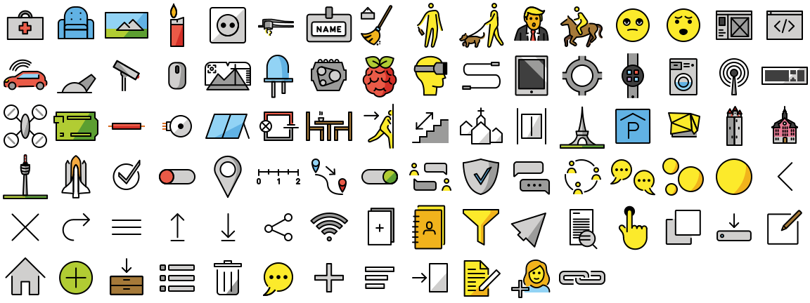](png/extras-openmoji-01.png)

  
<strong>PNG 72px sheets</strong>

  Merged image: <a href="png/extras-openmoji-01.png">extras-openmoji-01.png</a> 
  HTML image map: <a href="png/extras-openmoji-01.html">extras-openmoji-01.html</a> 
  CSS sprite sheet: <a href="png/extras-openmoji-01.css">extras-openmoji-01.css</a> 
  CSS sprite example: <a href="png/extras-openmoji-01-css.html">extras-openmoji-01-css.html</a> 
  Custom JSON: <a href="png/extras-openmoji-01.json">extras-openmoji-01.json</a>

  
<strong>SVG sheets</strong>

  Merged image: <a href="svg/extras-openmoji-01.svg">extras-openmoji-01.svg</a> 
  HTML image map: <a href="svg/extras-openmoji-01.html">extras-openmoji-01.html</a> 
  CSS sprite sheet: <a href="svg/extras-openmoji-01.css">extras-openmoji-01.css</a> 
  CSS sprite example: <a href="svg/extras-openmoji-01-css.html">extras-openmoji-01-css.html</a> 
  Custom JSON: <a href="svg/extras-openmoji-01.json">extras-openmoji-01.json</a>

  

## ℹ About

Images licensed under [CC-BY-SA 4.0](https://creativecommons.org/licenses/by-sa/4.0/legalcode). 
Emojis by [OpenMoji.org](https://openmoji.org/).

Improve this page via [GitHub](https://github.com/axelpale/openmoji-sprites).
