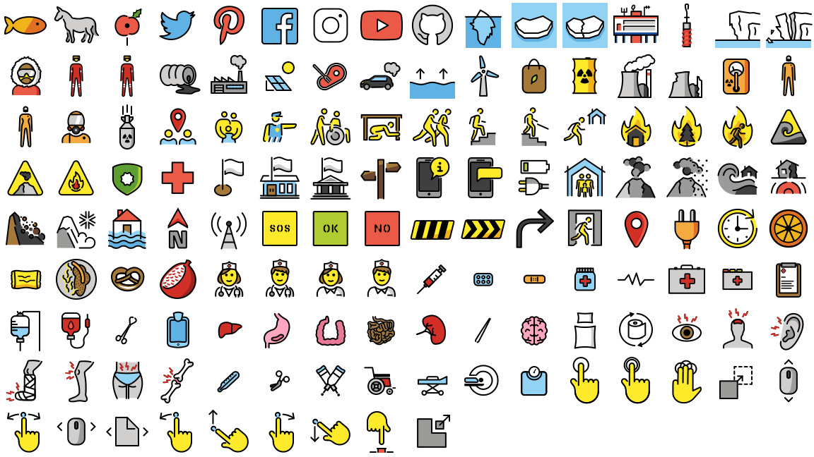

<link href="https://fonts.googleapis.com/css?family=Source+Sans+Pro:400,600,700" rel="stylesheet">

This project is a work-in-progress attempt to create a practical set of
sprite sheets for [OpenMoji.org](https://openmoji.org/) emojis. The sprite sheets
presented here were generated with
[axelpale/openmoji-spritemap-generator](https://github.com/axelpale/openmoji-spritemap-generator)
and are licensed under [CC-BY-SA 4.0](https://creativecommons.org/licenses/by-sa/4.0/legalcode).

* [😀 smileys-emotion](#-smileys-emotion)
* [👋 people-body](#-people-body)
* [🐵 animals-nature](#-animals-nature)
* [🍇 food-drink](#-food-drink)
* [🌍 travel-places](#-travel-places)
* [🎃 activities](#-activities)
* [👓 objects](#-objects)
* [🏧 symbols](#-symbols)
* [🏁 flags](#-flags)
* [🦄 extras-openmoji](#-extras-openmoji)
* [ℹ about](#ℹ-about)

## Download

Download all PNG and SVG sprites and their CSS sheets as one package:

> [openmoji-sprites.zip](https://github.com/axelpale/openmoji-sprites/releases/download/2.0.0/openmoji-sprites-v2.0.0.zip)

Alternatively via command line:

    $ wget https://github.com/axelpale/openmoji-sprites/releases/download/2.0.0/openmoji-sprites-v2.0.0.zip

To download a single emoji group, see the emojis and files below.

How to use the files? See the html examples in the package.

## 😀 smileys-emotion

  
<strong>PNG 72px sheets</strong>

  

  Sheet image: <a href="png/smileys-emotion-00.png">smileys-emotion-00.png</a> ~ 218 kB 
  CSS sprite sheet: <a href="png/smileys-emotion-00.css">smileys-emotion-00.css</a> ~ 9 kB 
  Custom JSON: <a href="png/smileys-emotion-00.json">smileys-emotion-00.json</a> 
  Hexcodes JS: <a href="png/smileys-emotion-00-hexcodes.js">smileys-emotion-00-hexcodes.js</a>
  

  <h6>Usage examples for PNG sheets</h6>
  

  HTML image map: <a href="png/smileys-emotion-00.html">smileys-emotion-00.html</a> 
  CSS sprites: <a href="png/smileys-emotion-00-css.html">smileys-emotion-00-css.html</a>
  

  
<strong>SVG sheets</strong>

  

  Sheet image: <a href="svg/smileys-emotion-00.svg">smileys-emotion-00.svg</a> ~ 202 kB 
  CSS sprite sheet: <a href="svg/smileys-emotion-00.css">smileys-emotion-00.css</a> ~ 15 kB 
  Custom JSON: <a href="svg/smileys-emotion-00.json">smileys-emotion-00.json</a> 
  Hexcodes JS: <a href="svg/smileys-emotion-00-hexcodes.js">smileys-emotion-00-hexcodes.js</a>
  

  <h6>Usage examples for SVG sheets</h6>
  

  HTML image map: <a href="svg/smileys-emotion-00.html">smileys-emotion-00.html</a> 
  CSS sprites: <a href="svg/smileys-emotion-00-css.html">smileys-emotion-00-css.html</a>
  

  

## 👋 people-body

  
<strong>PNG 72px sheets</strong>

  

  Sheet image: <a href="png/people-body-00.png">people-body-00.png</a> ~ 235 kB 
  CSS sprite sheet: <a href="png/people-body-00.css">people-body-00.css</a> ~ 9 kB 
  Custom JSON: <a href="png/people-body-00.json">people-body-00.json</a> 
  Hexcodes JS: <a href="png/people-body-00-hexcodes.js">people-body-00-hexcodes.js</a>
  

  <h6>Usage examples for PNG sheets</h6>
  

  HTML image map: <a href="png/people-body-00.html">people-body-00.html</a> 
  CSS sprites: <a href="png/people-body-00-css.html">people-body-00-css.html</a>
  

  
<strong>SVG sheets</strong>

  

  Sheet image: <a href="svg/people-body-00.svg">people-body-00.svg</a> ~ 219 kB 
  CSS sprite sheet: <a href="svg/people-body-00.css">people-body-00.css</a> ~ 16 kB 
  Custom JSON: <a href="svg/people-body-00.json">people-body-00.json</a> 
  Hexcodes JS: <a href="svg/people-body-00-hexcodes.js">people-body-00-hexcodes.js</a>
  

  <h6>Usage examples for SVG sheets</h6>
  

  HTML image map: <a href="svg/people-body-00.html">people-body-00.html</a> 
  CSS sprites: <a href="svg/people-body-00-css.html">people-body-00-css.html</a>
  

  

  
<strong>PNG 72px sheets</strong>

  

  Sheet image: <a href="png/people-body-01.png">people-body-01.png</a> ~ 171 kB 
  CSS sprite sheet: <a href="png/people-body-01.css">people-body-01.css</a> ~ 6 kB 
  Custom JSON: <a href="png/people-body-01.json">people-body-01.json</a> 
  Hexcodes JS: <a href="png/people-body-01-hexcodes.js">people-body-01-hexcodes.js</a>
  

  <h6>Usage examples for PNG sheets</h6>
  

  HTML image map: <a href="png/people-body-01.html">people-body-01.html</a> 
  CSS sprites: <a href="png/people-body-01-css.html">people-body-01-css.html</a>
  

  
<strong>SVG sheets</strong>

  

  Sheet image: <a href="svg/people-body-01.svg">people-body-01.svg</a> ~ 168 kB 
  CSS sprite sheet: <a href="svg/people-body-01.css">people-body-01.css</a> ~ 10 kB 
  Custom JSON: <a href="svg/people-body-01.json">people-body-01.json</a> 
  Hexcodes JS: <a href="svg/people-body-01-hexcodes.js">people-body-01-hexcodes.js</a>
  

  <h6>Usage examples for SVG sheets</h6>
  

  HTML image map: <a href="svg/people-body-01.html">people-body-01.html</a> 
  CSS sprites: <a href="svg/people-body-01-css.html">people-body-01-css.html</a>
  

  

  
<strong>PNG 72px sheets</strong>

  

  Sheet image: <a href="png/people-body-02.png">people-body-02.png</a> ~ 149 kB 
  CSS sprite sheet: <a href="png/people-body-02.css">people-body-02.css</a> ~ 11 kB 
  Custom JSON: <a href="png/people-body-02.json">people-body-02.json</a> 
  Hexcodes JS: <a href="png/people-body-02-hexcodes.js">people-body-02-hexcodes.js</a>
  

  <h6>Usage examples for PNG sheets</h6>
  

  HTML image map: <a href="png/people-body-02.html">people-body-02.html</a> 
  CSS sprites: <a href="png/people-body-02-css.html">people-body-02-css.html</a>
  

  
<strong>SVG sheets</strong>

  

  Sheet image: <a href="svg/people-body-02.svg">people-body-02.svg</a> ~ 199 kB 
  CSS sprite sheet: <a href="svg/people-body-02.css">people-body-02.css</a> ~ 17 kB 
  Custom JSON: <a href="svg/people-body-02.json">people-body-02.json</a> 
  Hexcodes JS: <a href="svg/people-body-02-hexcodes.js">people-body-02-hexcodes.js</a>
  

  <h6>Usage examples for SVG sheets</h6>
  

  HTML image map: <a href="svg/people-body-02.html">people-body-02.html</a> 
  CSS sprites: <a href="svg/people-body-02-css.html">people-body-02-css.html</a>
  

  

  
<strong>PNG 72px sheets</strong>

  

  Sheet image: <a href="png/people-body-03.png">people-body-03.png</a> ~ 289 kB 
  CSS sprite sheet: <a href="png/people-body-03.css">people-body-03.css</a> ~ 13 kB 
  Custom JSON: <a href="png/people-body-03.json">people-body-03.json</a> 
  Hexcodes JS: <a href="png/people-body-03-hexcodes.js">people-body-03-hexcodes.js</a>
  

  <h6>Usage examples for PNG sheets</h6>
  

  HTML image map: <a href="png/people-body-03.html">people-body-03.html</a> 
  CSS sprites: <a href="png/people-body-03-css.html">people-body-03-css.html</a>
  

  
<strong>SVG sheets</strong>

  

  Sheet image: <a href="svg/people-body-03.svg">people-body-03.svg</a> ~ 375 kB 
  CSS sprite sheet: <a href="svg/people-body-03.css">people-body-03.css</a> ~ 21 kB 
  Custom JSON: <a href="svg/people-body-03.json">people-body-03.json</a> 
  Hexcodes JS: <a href="svg/people-body-03-hexcodes.js">people-body-03-hexcodes.js</a>
  

  <h6>Usage examples for SVG sheets</h6>
  

  HTML image map: <a href="svg/people-body-03.html">people-body-03.html</a> 
  CSS sprites: <a href="svg/people-body-03-css.html">people-body-03-css.html</a>
  

  

  
<strong>PNG 72px sheets</strong>

  

  Sheet image: <a href="png/people-body-04.png">people-body-04.png</a> ~ 250 kB 
  CSS sprite sheet: <a href="png/people-body-04.css">people-body-04.css</a> ~ 13 kB 
  Custom JSON: <a href="png/people-body-04.json">people-body-04.json</a> 
  Hexcodes JS: <a href="png/people-body-04-hexcodes.js">people-body-04-hexcodes.js</a>
  

  <h6>Usage examples for PNG sheets</h6>
  

  HTML image map: <a href="png/people-body-04.html">people-body-04.html</a> 
  CSS sprites: <a href="png/people-body-04-css.html">people-body-04-css.html</a>
  

  
<strong>SVG sheets</strong>

  

  Sheet image: <a href="svg/people-body-04.svg">people-body-04.svg</a> ~ 660 kB 
  CSS sprite sheet: <a href="svg/people-body-04.css">people-body-04.css</a> ~ 21 kB 
  Custom JSON: <a href="svg/people-body-04.json">people-body-04.json</a> 
  Hexcodes JS: <a href="svg/people-body-04-hexcodes.js">people-body-04-hexcodes.js</a>
  

  <h6>Usage examples for SVG sheets</h6>
  

  HTML image map: <a href="svg/people-body-04.html">people-body-04.html</a> 
  CSS sprites: <a href="svg/people-body-04-css.html">people-body-04-css.html</a>
  

  

  
<strong>PNG 72px sheets</strong>

  

  Sheet image: <a href="png/people-body-05.png">people-body-05.png</a> ~ 257 kB 
  CSS sprite sheet: <a href="png/people-body-05.css">people-body-05.css</a> ~ 13 kB 
  Custom JSON: <a href="png/people-body-05.json">people-body-05.json</a> 
  Hexcodes JS: <a href="png/people-body-05-hexcodes.js">people-body-05-hexcodes.js</a>
  

  <h6>Usage examples for PNG sheets</h6>
  

  HTML image map: <a href="png/people-body-05.html">people-body-05.html</a> 
  CSS sprites: <a href="png/people-body-05-css.html">people-body-05-css.html</a>
  

  
<strong>SVG sheets</strong>

  

  Sheet image: <a href="svg/people-body-05.svg">people-body-05.svg</a> ~ 847 kB 
  CSS sprite sheet: <a href="svg/people-body-05.css">people-body-05.css</a> ~ 21 kB 
  Custom JSON: <a href="svg/people-body-05.json">people-body-05.json</a> 
  Hexcodes JS: <a href="svg/people-body-05-hexcodes.js">people-body-05-hexcodes.js</a>
  

  <h6>Usage examples for SVG sheets</h6>
  

  HTML image map: <a href="svg/people-body-05.html">people-body-05.html</a> 
  CSS sprites: <a href="svg/people-body-05-css.html">people-body-05-css.html</a>
  

  

  
<strong>PNG 72px sheets</strong>

  

  Sheet image: <a href="png/people-body-06.png">people-body-06.png</a> ~ 107 kB 
  CSS sprite sheet: <a href="png/people-body-06.css">people-body-06.css</a> ~ 4 kB 
  Custom JSON: <a href="png/people-body-06.json">people-body-06.json</a> 
  Hexcodes JS: <a href="png/people-body-06-hexcodes.js">people-body-06-hexcodes.js</a>
  

  <h6>Usage examples for PNG sheets</h6>
  

  HTML image map: <a href="png/people-body-06.html">people-body-06.html</a> 
  CSS sprites: <a href="png/people-body-06-css.html">people-body-06-css.html</a>
  

  
<strong>SVG sheets</strong>

  

  Sheet image: <a href="svg/people-body-06.svg">people-body-06.svg</a> ~ 190 kB 
  CSS sprite sheet: <a href="svg/people-body-06.css">people-body-06.css</a> ~ 7 kB 
  Custom JSON: <a href="svg/people-body-06.json">people-body-06.json</a> 
  Hexcodes JS: <a href="svg/people-body-06-hexcodes.js">people-body-06-hexcodes.js</a>
  

  <h6>Usage examples for SVG sheets</h6>
  

  HTML image map: <a href="svg/people-body-06.html">people-body-06.html</a> 
  CSS sprites: <a href="svg/people-body-06-css.html">people-body-06-css.html</a>
  

  

  
<strong>PNG 72px sheets</strong>

  

  Sheet image: <a href="png/people-body-07.png">people-body-07.png</a> ~ 235 kB 
  CSS sprite sheet: <a href="png/people-body-07.css">people-body-07.css</a> ~ 11 kB 
  Custom JSON: <a href="png/people-body-07.json">people-body-07.json</a> 
  Hexcodes JS: <a href="png/people-body-07-hexcodes.js">people-body-07-hexcodes.js</a>
  

  <h6>Usage examples for PNG sheets</h6>
  

  HTML image map: <a href="png/people-body-07.html">people-body-07.html</a> 
  CSS sprites: <a href="png/people-body-07-css.html">people-body-07-css.html</a>
  

  
<strong>SVG sheets</strong>

  

  Sheet image: <a href="svg/people-body-07.svg">people-body-07.svg</a> ~ 461 kB 
  CSS sprite sheet: <a href="svg/people-body-07.css">people-body-07.css</a> ~ 17 kB 
  Custom JSON: <a href="svg/people-body-07.json">people-body-07.json</a> 
  Hexcodes JS: <a href="svg/people-body-07-hexcodes.js">people-body-07-hexcodes.js</a>
  

  <h6>Usage examples for SVG sheets</h6>
  

  HTML image map: <a href="svg/people-body-07.html">people-body-07.html</a> 
  CSS sprites: <a href="svg/people-body-07-css.html">people-body-07-css.html</a>
  

  

  
<strong>PNG 72px sheets</strong>

  

  Sheet image: <a href="png/people-body-08.png">people-body-08.png</a> ~ 167 kB 
  CSS sprite sheet: <a href="png/people-body-08.css">people-body-08.css</a> ~ 9 kB 
  Custom JSON: <a href="png/people-body-08.json">people-body-08.json</a> 
  Hexcodes JS: <a href="png/people-body-08-hexcodes.js">people-body-08-hexcodes.js</a>
  

  <h6>Usage examples for PNG sheets</h6>
  

  HTML image map: <a href="png/people-body-08.html">people-body-08.html</a> 
  CSS sprites: <a href="png/people-body-08-css.html">people-body-08-css.html</a>
  

  
<strong>SVG sheets</strong>

  

  Sheet image: <a href="svg/people-body-08.svg">people-body-08.svg</a> ~ 215 kB 
  CSS sprite sheet: <a href="svg/people-body-08.css">people-body-08.css</a> ~ 11 kB 
  Custom JSON: <a href="svg/people-body-08.json">people-body-08.json</a> 
  Hexcodes JS: <a href="svg/people-body-08-hexcodes.js">people-body-08-hexcodes.js</a>
  

  <h6>Usage examples for SVG sheets</h6>
  

  HTML image map: <a href="svg/people-body-08.html">people-body-08.html</a> 
  CSS sprites: <a href="svg/people-body-08-css.html">people-body-08-css.html</a>
  

  

  
<strong>PNG 72px sheets</strong>

  

  Sheet image: <a href="png/people-body-09.png">people-body-09.png</a> ~ 132 kB 
  CSS sprite sheet: <a href="png/people-body-09.css">people-body-09.css</a> ~ 7 kB 
  Custom JSON: <a href="png/people-body-09.json">people-body-09.json</a> 
  Hexcodes JS: <a href="png/people-body-09-hexcodes.js">people-body-09-hexcodes.js</a>
  

  <h6>Usage examples for PNG sheets</h6>
  

  HTML image map: <a href="png/people-body-09.html">people-body-09.html</a> 
  CSS sprites: <a href="png/people-body-09-css.html">people-body-09-css.html</a>
  

  
<strong>SVG sheets</strong>

  

  Sheet image: <a href="svg/people-body-09.svg">people-body-09.svg</a> ~ 176 kB 
  CSS sprite sheet: <a href="svg/people-body-09.css">people-body-09.css</a> ~ 12 kB 
  Custom JSON: <a href="svg/people-body-09.json">people-body-09.json</a> 
  Hexcodes JS: <a href="svg/people-body-09-hexcodes.js">people-body-09-hexcodes.js</a>
  

  <h6>Usage examples for SVG sheets</h6>
  

  HTML image map: <a href="svg/people-body-09.html">people-body-09.html</a> 
  CSS sprites: <a href="svg/people-body-09-css.html">people-body-09-css.html</a>
  

  

  
<strong>PNG 72px sheets</strong>

  

  Sheet image: <a href="png/people-body-10.png">people-body-10.png</a> ~ 155 kB 
  CSS sprite sheet: <a href="png/people-body-10.css">people-body-10.css</a> ~ 9 kB 
  Custom JSON: <a href="png/people-body-10.json">people-body-10.json</a> 
  Hexcodes JS: <a href="png/people-body-10-hexcodes.js">people-body-10-hexcodes.js</a>
  

  <h6>Usage examples for PNG sheets</h6>
  

  HTML image map: <a href="png/people-body-10.html">people-body-10.html</a> 
  CSS sprites: <a href="png/people-body-10-css.html">people-body-10-css.html</a>
  

  
<strong>SVG sheets</strong>

  

  Sheet image: <a href="svg/people-body-10.svg">people-body-10.svg</a> ~ 221 kB 
  CSS sprite sheet: <a href="svg/people-body-10.css">people-body-10.css</a> ~ 11 kB 
  Custom JSON: <a href="svg/people-body-10.json">people-body-10.json</a> 
  Hexcodes JS: <a href="svg/people-body-10-hexcodes.js">people-body-10-hexcodes.js</a>
  

  <h6>Usage examples for SVG sheets</h6>
  

  HTML image map: <a href="svg/people-body-10.html">people-body-10.html</a> 
  CSS sprites: <a href="svg/people-body-10-css.html">people-body-10-css.html</a>
  

  

  
<strong>PNG 72px sheets</strong>

  

  Sheet image: <a href="png/people-body-11.png">people-body-11.png</a> ~ 159 kB 
  CSS sprite sheet: <a href="png/people-body-11.css">people-body-11.css</a> ~ 8 kB 
  Custom JSON: <a href="png/people-body-11.json">people-body-11.json</a> 
  Hexcodes JS: <a href="png/people-body-11-hexcodes.js">people-body-11-hexcodes.js</a>
  

  <h6>Usage examples for PNG sheets</h6>
  

  HTML image map: <a href="png/people-body-11.html">people-body-11.html</a> 
  CSS sprites: <a href="png/people-body-11-css.html">people-body-11-css.html</a>
  

  
<strong>SVG sheets</strong>

  

  Sheet image: <a href="svg/people-body-11.svg">people-body-11.svg</a> ~ 186 kB 
  CSS sprite sheet: <a href="svg/people-body-11.css">people-body-11.css</a> ~ 11 kB 
  Custom JSON: <a href="svg/people-body-11.json">people-body-11.json</a> 
  Hexcodes JS: <a href="svg/people-body-11-hexcodes.js">people-body-11-hexcodes.js</a>
  

  <h6>Usage examples for SVG sheets</h6>
  

  HTML image map: <a href="svg/people-body-11.html">people-body-11.html</a> 
  CSS sprites: <a href="svg/people-body-11-css.html">people-body-11-css.html</a>
  

  

  
<strong>PNG 72px sheets</strong>

  

  Sheet image: <a href="png/people-body-12.png">people-body-12.png</a> ~ 27 kB 
  CSS sprite sheet: <a href="png/people-body-12.css">people-body-12.css</a> ~ 2 kB 
  Custom JSON: <a href="png/people-body-12.json">people-body-12.json</a> 
  Hexcodes JS: <a href="png/people-body-12-hexcodes.js">people-body-12-hexcodes.js</a>
  

  <h6>Usage examples for PNG sheets</h6>
  

  HTML image map: <a href="png/people-body-12.html">people-body-12.html</a> 
  CSS sprites: <a href="png/people-body-12-css.html">people-body-12-css.html</a>
  

  
<strong>SVG sheets</strong>

  

  Sheet image: <a href="svg/people-body-12.svg">people-body-12.svg</a> ~ 48 kB 
  CSS sprite sheet: <a href="svg/people-body-12.css">people-body-12.css</a> ~ 3 kB 
  Custom JSON: <a href="svg/people-body-12.json">people-body-12.json</a> 
  Hexcodes JS: <a href="svg/people-body-12-hexcodes.js">people-body-12-hexcodes.js</a>
  

  <h6>Usage examples for SVG sheets</h6>
  

  HTML image map: <a href="svg/people-body-12.html">people-body-12.html</a> 
  CSS sprites: <a href="svg/people-body-12-css.html">people-body-12-css.html</a>
  

  

  
<strong>PNG 72px sheets</strong>

  

  Sheet image: <a href="png/people-body-13.png">people-body-13.png</a> ~ 201 kB 
  CSS sprite sheet: <a href="png/people-body-13.css">people-body-13.css</a> ~ 12 kB 
  Custom JSON: <a href="png/people-body-13.json">people-body-13.json</a> 
  Hexcodes JS: <a href="png/people-body-13-hexcodes.js">people-body-13-hexcodes.js</a>
  

  <h6>Usage examples for PNG sheets</h6>
  

  HTML image map: <a href="png/people-body-13.html">people-body-13.html</a> 
  CSS sprites: <a href="png/people-body-13-css.html">people-body-13-css.html</a>
  

  
<strong>SVG sheets</strong>

  

  Sheet image: <a href="svg/people-body-13.svg">people-body-13.svg</a> ~ 358 kB 
  CSS sprite sheet: <a href="svg/people-body-13.css">people-body-13.css</a> ~ 19 kB 
  Custom JSON: <a href="svg/people-body-13.json">people-body-13.json</a> 
  Hexcodes JS: <a href="svg/people-body-13-hexcodes.js">people-body-13-hexcodes.js</a>
  

  <h6>Usage examples for SVG sheets</h6>
  

  HTML image map: <a href="svg/people-body-13.html">people-body-13.html</a> 
  CSS sprites: <a href="svg/people-body-13-css.html">people-body-13-css.html</a>
  

  

## 🐵 animals-nature

  
<strong>PNG 72px sheets</strong>

  

  Sheet image: <a href="png/animals-nature-00.png">animals-nature-00.png</a> ~ 265 kB 
  CSS sprite sheet: <a href="png/animals-nature-00.css">animals-nature-00.css</a> ~ 8 kB 
  Custom JSON: <a href="png/animals-nature-00.json">animals-nature-00.json</a> 
  Hexcodes JS: <a href="png/animals-nature-00-hexcodes.js">animals-nature-00-hexcodes.js</a>
  

  <h6>Usage examples for PNG sheets</h6>
  

  HTML image map: <a href="png/animals-nature-00.html">animals-nature-00.html</a> 
  CSS sprites: <a href="png/animals-nature-00-css.html">animals-nature-00-css.html</a>
  

  
<strong>SVG sheets</strong>

  

  Sheet image: <a href="svg/animals-nature-00.svg">animals-nature-00.svg</a> ~ 259 kB 
  CSS sprite sheet: <a href="svg/animals-nature-00.css">animals-nature-00.css</a> ~ 12 kB 
  Custom JSON: <a href="svg/animals-nature-00.json">animals-nature-00.json</a> 
  Hexcodes JS: <a href="svg/animals-nature-00-hexcodes.js">animals-nature-00-hexcodes.js</a>
  

  <h6>Usage examples for SVG sheets</h6>
  

  HTML image map: <a href="svg/animals-nature-00.html">animals-nature-00.html</a> 
  CSS sprites: <a href="svg/animals-nature-00-css.html">animals-nature-00-css.html</a>
  

  

## 🍇 food-drink

  
<strong>PNG 72px sheets</strong>

  

  Sheet image: <a href="png/food-drink-00.png">food-drink-00.png</a> ~ 208 kB 
  CSS sprite sheet: <a href="png/food-drink-00.css">food-drink-00.css</a> ~ 7 kB 
  Custom JSON: <a href="png/food-drink-00.json">food-drink-00.json</a> 
  Hexcodes JS: <a href="png/food-drink-00-hexcodes.js">food-drink-00-hexcodes.js</a>
  

  <h6>Usage examples for PNG sheets</h6>
  

  HTML image map: <a href="png/food-drink-00.html">food-drink-00.html</a> 
  CSS sprites: <a href="png/food-drink-00-css.html">food-drink-00-css.html</a>
  

  
<strong>SVG sheets</strong>

  

  Sheet image: <a href="svg/food-drink-00.svg">food-drink-00.svg</a> ~ 236 kB 
  CSS sprite sheet: <a href="svg/food-drink-00.css">food-drink-00.css</a> ~ 12 kB 
  Custom JSON: <a href="svg/food-drink-00.json">food-drink-00.json</a> 
  Hexcodes JS: <a href="svg/food-drink-00-hexcodes.js">food-drink-00-hexcodes.js</a>
  

  <h6>Usage examples for SVG sheets</h6>
  

  HTML image map: <a href="svg/food-drink-00.html">food-drink-00.html</a> 
  CSS sprites: <a href="svg/food-drink-00-css.html">food-drink-00-css.html</a>
  

  

## 🌍 travel-places

  
<strong>PNG 72px sheets</strong>

  

  Sheet image: <a href="png/travel-places-00.png">travel-places-00.png</a> ~ 83 kB 
  CSS sprite sheet: <a href="png/travel-places-00.css">travel-places-00.css</a> ~ 4 kB 
  Custom JSON: <a href="png/travel-places-00.json">travel-places-00.json</a> 
  Hexcodes JS: <a href="png/travel-places-00-hexcodes.js">travel-places-00-hexcodes.js</a>
  

  <h6>Usage examples for PNG sheets</h6>
  

  HTML image map: <a href="png/travel-places-00.html">travel-places-00.html</a> 
  CSS sprites: <a href="png/travel-places-00-css.html">travel-places-00-css.html</a>
  

  
<strong>SVG sheets</strong>

  

  Sheet image: <a href="svg/travel-places-00.svg">travel-places-00.svg</a> ~ 96 kB 
  CSS sprite sheet: <a href="svg/travel-places-00.css">travel-places-00.css</a> ~ 6 kB 
  Custom JSON: <a href="svg/travel-places-00.json">travel-places-00.json</a> 
  Hexcodes JS: <a href="svg/travel-places-00-hexcodes.js">travel-places-00-hexcodes.js</a>
  

  <h6>Usage examples for SVG sheets</h6>
  

  HTML image map: <a href="svg/travel-places-00.html">travel-places-00.html</a> 
  CSS sprites: <a href="svg/travel-places-00-css.html">travel-places-00-css.html</a>
  

  

  
<strong>PNG 72px sheets</strong>

  

  Sheet image: <a href="png/travel-places-01.png">travel-places-01.png</a> ~ 196 kB 
  CSS sprite sheet: <a href="png/travel-places-01.css">travel-places-01.css</a> ~ 9 kB 
  Custom JSON: <a href="png/travel-places-01.json">travel-places-01.json</a> 
  Hexcodes JS: <a href="png/travel-places-01-hexcodes.js">travel-places-01-hexcodes.js</a>
  

  <h6>Usage examples for PNG sheets</h6>
  

  HTML image map: <a href="png/travel-places-01.html">travel-places-01.html</a> 
  CSS sprites: <a href="png/travel-places-01-css.html">travel-places-01-css.html</a>
  

  
<strong>SVG sheets</strong>

  

  Sheet image: <a href="svg/travel-places-01.svg">travel-places-01.svg</a> ~ 212 kB 
  CSS sprite sheet: <a href="svg/travel-places-01.css">travel-places-01.css</a> ~ 15 kB 
  Custom JSON: <a href="svg/travel-places-01.json">travel-places-01.json</a> 
  Hexcodes JS: <a href="svg/travel-places-01-hexcodes.js">travel-places-01-hexcodes.js</a>
  

  <h6>Usage examples for SVG sheets</h6>
  

  HTML image map: <a href="svg/travel-places-01.html">travel-places-01.html</a> 
  CSS sprites: <a href="svg/travel-places-01-css.html">travel-places-01-css.html</a>
  

  

## 🎃 activities

  
<strong>PNG 72px sheets</strong>

  

  Sheet image: <a href="png/activities-00.png">activities-00.png</a> ~ 154 kB 
  CSS sprite sheet: <a href="png/activities-00.css">activities-00.css</a> ~ 5 kB 
  Custom JSON: <a href="png/activities-00.json">activities-00.json</a> 
  Hexcodes JS: <a href="png/activities-00-hexcodes.js">activities-00-hexcodes.js</a>
  

  <h6>Usage examples for PNG sheets</h6>
  

  HTML image map: <a href="png/activities-00.html">activities-00.html</a> 
  CSS sprites: <a href="png/activities-00-css.html">activities-00-css.html</a>
  

  
<strong>SVG sheets</strong>

  

  Sheet image: <a href="svg/activities-00.svg">activities-00.svg</a> ~ 140 kB 
  CSS sprite sheet: <a href="svg/activities-00.css">activities-00.css</a> ~ 8 kB 
  Custom JSON: <a href="svg/activities-00.json">activities-00.json</a> 
  Hexcodes JS: <a href="svg/activities-00-hexcodes.js">activities-00-hexcodes.js</a>
  

  <h6>Usage examples for SVG sheets</h6>
  

  HTML image map: <a href="svg/activities-00.html">activities-00.html</a> 
  CSS sprites: <a href="svg/activities-00-css.html">activities-00-css.html</a>
  

  

## 👓 objects

  
<strong>PNG 72px sheets</strong>

  

  Sheet image: <a href="png/objects-00.png">objects-00.png</a> ~ 172 kB 
  CSS sprite sheet: <a href="png/objects-00.css">objects-00.css</a> ~ 8 kB 
  Custom JSON: <a href="png/objects-00.json">objects-00.json</a> 
  Hexcodes JS: <a href="png/objects-00-hexcodes.js">objects-00-hexcodes.js</a>
  

  <h6>Usage examples for PNG sheets</h6>
  

  HTML image map: <a href="png/objects-00.html">objects-00.html</a> 
  CSS sprites: <a href="png/objects-00-css.html">objects-00-css.html</a>
  

  
<strong>SVG sheets</strong>

  

  Sheet image: <a href="svg/objects-00.svg">objects-00.svg</a> ~ 168 kB 
  CSS sprite sheet: <a href="svg/objects-00.css">objects-00.css</a> ~ 12 kB 
  Custom JSON: <a href="svg/objects-00.json">objects-00.json</a> 
  Hexcodes JS: <a href="svg/objects-00-hexcodes.js">objects-00-hexcodes.js</a>
  

  <h6>Usage examples for SVG sheets</h6>
  

  HTML image map: <a href="svg/objects-00.html">objects-00.html</a> 
  CSS sprites: <a href="svg/objects-00-css.html">objects-00-css.html</a>
  

  

  
<strong>PNG 72px sheets</strong>

  

  Sheet image: <a href="png/objects-01.png">objects-01.png</a> ~ 129 kB 
  CSS sprite sheet: <a href="png/objects-01.css">objects-01.css</a> ~ 6 kB 
  Custom JSON: <a href="png/objects-01.json">objects-01.json</a> 
  Hexcodes JS: <a href="png/objects-01-hexcodes.js">objects-01-hexcodes.js</a>
  

  <h6>Usage examples for PNG sheets</h6>
  

  HTML image map: <a href="png/objects-01.html">objects-01.html</a> 
  CSS sprites: <a href="png/objects-01-css.html">objects-01-css.html</a>
  

  
<strong>SVG sheets</strong>

  

  Sheet image: <a href="svg/objects-01.svg">objects-01.svg</a> ~ 144 kB 
  CSS sprite sheet: <a href="svg/objects-01.css">objects-01.css</a> ~ 9 kB 
  Custom JSON: <a href="svg/objects-01.json">objects-01.json</a> 
  Hexcodes JS: <a href="svg/objects-01-hexcodes.js">objects-01-hexcodes.js</a>
  

  <h6>Usage examples for SVG sheets</h6>
  

  HTML image map: <a href="svg/objects-01.html">objects-01.html</a> 
  CSS sprites: <a href="svg/objects-01-css.html">objects-01-css.html</a>
  

  

## 🏧 symbols

  
<strong>PNG 72px sheets</strong>

  

  Sheet image: <a href="png/symbols-00.png">symbols-00.png</a> ~ 114 kB 
  CSS sprite sheet: <a href="png/symbols-00.css">symbols-00.css</a> ~ 6 kB 
  Custom JSON: <a href="png/symbols-00.json">symbols-00.json</a> 
  Hexcodes JS: <a href="png/symbols-00-hexcodes.js">symbols-00-hexcodes.js</a>
  

  <h6>Usage examples for PNG sheets</h6>
  

  HTML image map: <a href="png/symbols-00.html">symbols-00.html</a> 
  CSS sprites: <a href="png/symbols-00-css.html">symbols-00-css.html</a>
  

  
<strong>SVG sheets</strong>

  

  Sheet image: <a href="svg/symbols-00.svg">symbols-00.svg</a> ~ 120 kB 
  CSS sprite sheet: <a href="svg/symbols-00.css">symbols-00.css</a> ~ 10 kB 
  Custom JSON: <a href="svg/symbols-00.json">symbols-00.json</a> 
  Hexcodes JS: <a href="svg/symbols-00-hexcodes.js">symbols-00-hexcodes.js</a>
  

  <h6>Usage examples for SVG sheets</h6>
  

  HTML image map: <a href="svg/symbols-00.html">symbols-00.html</a> 
  CSS sprites: <a href="svg/symbols-00-css.html">symbols-00-css.html</a>
  

  

  
<strong>PNG 72px sheets</strong>

  

  Sheet image: <a href="png/symbols-01.png">symbols-01.png</a> ~ 96 kB 
  CSS sprite sheet: <a href="png/symbols-01.css">symbols-01.css</a> ~ 7 kB 
  Custom JSON: <a href="png/symbols-01.json">symbols-01.json</a> 
  Hexcodes JS: <a href="png/symbols-01-hexcodes.js">symbols-01-hexcodes.js</a>
  

  <h6>Usage examples for PNG sheets</h6>
  

  HTML image map: <a href="png/symbols-01.html">symbols-01.html</a> 
  CSS sprites: <a href="png/symbols-01-css.html">symbols-01-css.html</a>
  

  
<strong>SVG sheets</strong>

  

  Sheet image: <a href="svg/symbols-01.svg">symbols-01.svg</a> ~ 94 kB 
  CSS sprite sheet: <a href="svg/symbols-01.css">symbols-01.css</a> ~ 10 kB 
  Custom JSON: <a href="svg/symbols-01.json">symbols-01.json</a> 
  Hexcodes JS: <a href="svg/symbols-01-hexcodes.js">symbols-01-hexcodes.js</a>
  

  <h6>Usage examples for SVG sheets</h6>
  

  HTML image map: <a href="svg/symbols-01.html">symbols-01.html</a> 
  CSS sprites: <a href="svg/symbols-01-css.html">symbols-01-css.html</a>
  

  

## 🏁 flags

  
<strong>PNG 72px sheets</strong>

  

  Sheet image: <a href="png/flags-00.png">flags-00.png</a> ~ 7 kB 
  CSS sprite sheet: <a href="png/flags-00.css">flags-00.css</a> ~ 1 kB 
  Custom JSON: <a href="png/flags-00.json">flags-00.json</a> 
  Hexcodes JS: <a href="png/flags-00-hexcodes.js">flags-00-hexcodes.js</a>
  

  <h6>Usage examples for PNG sheets</h6>
  

  HTML image map: <a href="png/flags-00.html">flags-00.html</a> 
  CSS sprites: <a href="png/flags-00-css.html">flags-00-css.html</a>
  

  
<strong>SVG sheets</strong>

  

  Sheet image: <a href="svg/flags-00.svg">flags-00.svg</a> ~ 11 kB 
  CSS sprite sheet: <a href="svg/flags-00.css">flags-00.css</a> ~ 1 kB 
  Custom JSON: <a href="svg/flags-00.json">flags-00.json</a> 
  Hexcodes JS: <a href="svg/flags-00-hexcodes.js">flags-00-hexcodes.js</a>
  

  <h6>Usage examples for SVG sheets</h6>
  

  HTML image map: <a href="svg/flags-00.html">flags-00.html</a> 
  CSS sprites: <a href="svg/flags-00-css.html">flags-00-css.html</a>
  

  

  
<strong>PNG 72px sheets</strong>

  

  Sheet image: <a href="png/flags-01.png">flags-01.png</a> ~ 64 kB 
  CSS sprite sheet: <a href="png/flags-01.css">flags-01.css</a> ~ 8 kB 
  Custom JSON: <a href="png/flags-01.json">flags-01.json</a> 
  Hexcodes JS: <a href="png/flags-01-hexcodes.js">flags-01-hexcodes.js</a>
  

  <h6>Usage examples for PNG sheets</h6>
  

  HTML image map: <a href="png/flags-01.html">flags-01.html</a> 
  CSS sprites: <a href="png/flags-01-css.html">flags-01-css.html</a>
  

  
<strong>SVG sheets</strong>

  

  Sheet image: <a href="svg/flags-01.svg">flags-01.svg</a> ~ 105 kB 
  CSS sprite sheet: <a href="svg/flags-01.css">flags-01.css</a> ~ 10 kB 
  Custom JSON: <a href="svg/flags-01.json">flags-01.json</a> 
  Hexcodes JS: <a href="svg/flags-01-hexcodes.js">flags-01-hexcodes.js</a>
  

  <h6>Usage examples for SVG sheets</h6>
  

  HTML image map: <a href="svg/flags-01.html">flags-01.html</a> 
  CSS sprites: <a href="svg/flags-01-css.html">flags-01-css.html</a>
  

  

  
<strong>PNG 72px sheets</strong>

  

  Sheet image: <a href="png/flags-02.png">flags-02.png</a> ~ 83 kB 
  CSS sprite sheet: <a href="png/flags-02.css">flags-02.css</a> ~ 9 kB 
  Custom JSON: <a href="png/flags-02.json">flags-02.json</a> 
  Hexcodes JS: <a href="png/flags-02-hexcodes.js">flags-02-hexcodes.js</a>
  

  <h6>Usage examples for PNG sheets</h6>
  

  HTML image map: <a href="png/flags-02.html">flags-02.html</a> 
  CSS sprites: <a href="png/flags-02-css.html">flags-02-css.html</a>
  

  
<strong>SVG sheets</strong>

  

  Sheet image: <a href="svg/flags-02.svg">flags-02.svg</a> ~ 120 kB 
  CSS sprite sheet: <a href="svg/flags-02.css">flags-02.css</a> ~ 15 kB 
  Custom JSON: <a href="svg/flags-02.json">flags-02.json</a> 
  Hexcodes JS: <a href="svg/flags-02-hexcodes.js">flags-02-hexcodes.js</a>
  

  <h6>Usage examples for SVG sheets</h6>
  

  HTML image map: <a href="svg/flags-02.html">flags-02.html</a> 
  CSS sprites: <a href="svg/flags-02-css.html">flags-02-css.html</a>
  

  

  
<strong>PNG 72px sheets</strong>

  

  Sheet image: <a href="png/flags-03.png">flags-03.png</a> ~ 3 kB 
  CSS sprite sheet: <a href="png/flags-03.css">flags-03.css</a> ~ 0 kB 
  Custom JSON: <a href="png/flags-03.json">flags-03.json</a> 
  Hexcodes JS: <a href="png/flags-03-hexcodes.js">flags-03-hexcodes.js</a>
  

  <h6>Usage examples for PNG sheets</h6>
  

  HTML image map: <a href="png/flags-03.html">flags-03.html</a> 
  CSS sprites: <a href="png/flags-03-css.html">flags-03-css.html</a>
  

  
<strong>SVG sheets</strong>

  

  Sheet image: <a href="svg/flags-03.svg">flags-03.svg</a> ~ 3 kB 
  CSS sprite sheet: <a href="svg/flags-03.css">flags-03.css</a> ~ 0 kB 
  Custom JSON: <a href="svg/flags-03.json">flags-03.json</a> 
  Hexcodes JS: <a href="svg/flags-03-hexcodes.js">flags-03-hexcodes.js</a>
  

  <h6>Usage examples for SVG sheets</h6>
  

  HTML image map: <a href="svg/flags-03.html">flags-03.html</a> 
  CSS sprites: <a href="svg/flags-03-css.html">flags-03-css.html</a>
  

  

## 🦄 extras-openmoji

  
<strong>PNG 72px sheets</strong>

  

  Sheet image: <a href="png/extras-openmoji-00.png">extras-openmoji-00.png</a> ~ 214 kB 
  CSS sprite sheet: <a href="png/extras-openmoji-00.css">extras-openmoji-00.css</a> ~ 8 kB 
  Custom JSON: <a href="png/extras-openmoji-00.json">extras-openmoji-00.json</a> 
  Hexcodes JS: <a href="png/extras-openmoji-00-hexcodes.js">extras-openmoji-00-hexcodes.js</a>
  

  <h6>Usage examples for PNG sheets</h6>
  

  HTML image map: <a href="png/extras-openmoji-00.html">extras-openmoji-00.html</a> 
  CSS sprites: <a href="png/extras-openmoji-00-css.html">extras-openmoji-00-css.html</a>
  

  
<strong>SVG sheets</strong>

  

  Sheet image: <a href="svg/extras-openmoji-00.svg">extras-openmoji-00.svg</a> ~ 271 kB 
  CSS sprite sheet: <a href="svg/extras-openmoji-00.css">extras-openmoji-00.css</a> ~ 14 kB 
  Custom JSON: <a href="svg/extras-openmoji-00.json">extras-openmoji-00.json</a> 
  Hexcodes JS: <a href="svg/extras-openmoji-00-hexcodes.js">extras-openmoji-00-hexcodes.js</a>
  

  <h6>Usage examples for SVG sheets</h6>
  

  HTML image map: <a href="svg/extras-openmoji-00.html">extras-openmoji-00.html</a> 
  CSS sprites: <a href="svg/extras-openmoji-00-css.html">extras-openmoji-00-css.html</a>
  

  

  
<strong>PNG 72px sheets</strong>

  

  Sheet image: <a href="png/extras-openmoji-01.png">extras-openmoji-01.png</a> ~ 104 kB 
  CSS sprite sheet: <a href="png/extras-openmoji-01.css">extras-openmoji-01.css</a> ~ 5 kB 
  Custom JSON: <a href="png/extras-openmoji-01.json">extras-openmoji-01.json</a> 
  Hexcodes JS: <a href="png/extras-openmoji-01-hexcodes.js">extras-openmoji-01-hexcodes.js</a>
  

  <h6>Usage examples for PNG sheets</h6>
  

  HTML image map: <a href="png/extras-openmoji-01.html">extras-openmoji-01.html</a> 
  CSS sprites: <a href="png/extras-openmoji-01-css.html">extras-openmoji-01-css.html</a>
  

  
<strong>SVG sheets</strong>

  

  Sheet image: <a href="svg/extras-openmoji-01.svg">extras-openmoji-01.svg</a> ~ 96 kB 
  CSS sprite sheet: <a href="svg/extras-openmoji-01.css">extras-openmoji-01.css</a> ~ 10 kB 
  Custom JSON: <a href="svg/extras-openmoji-01.json">extras-openmoji-01.json</a> 
  Hexcodes JS: <a href="svg/extras-openmoji-01-hexcodes.js">extras-openmoji-01-hexcodes.js</a>
  

  <h6>Usage examples for SVG sheets</h6>
  

  HTML image map: <a href="svg/extras-openmoji-01.html">extras-openmoji-01.html</a> 
  CSS sprites: <a href="svg/extras-openmoji-01-css.html">extras-openmoji-01-css.html</a>
  

  

## ℹ About

Images licensed under [CC-BY-SA 4.0](https://creativecommons.org/licenses/by-sa/4.0/legalcode). 
Emojis by [OpenMoji.org](https://openmoji.org/).

Improve this page via [GitHub](https://github.com/axelpale/openmoji-sprites).
